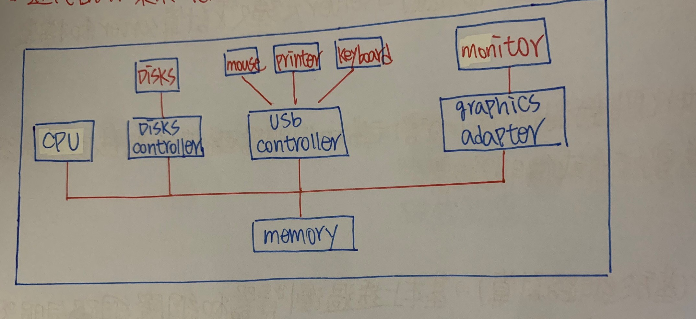

CH2 電腦系統架構
======

### 電腦系統的操作

+ 每一個Device Controller負責一個特定型態裝置

+ I/O Device和CPU可以同時執行並競爭Memory

+ 每一個I/O Device Controller有自己的Local Buffer(暫存器)

+ 電腦系統中，發生一個事件時，通常是由硬體或軟體產生中斷(Interrupt)通知

+ 近代作業系統是中斷驅動式(Interrupt Driven)



### 中斷(Interrupt)

+ Interrupt是電腦架構中重要一部分，每個電腦都有自己Interrupt技術

+ 在OS Area(作業系統區域)內會有中斷向量表(Interrupt Vector)和一組中斷服務程式(Interrupt Service Routine稱ISR)


### Interrupt發生處理步驟

+ OS要求CPU暫停目前Process執行，同時保持其當時執行狀態

+ 根據Interrupt ID去查詢Interrupt Vector，便可找到ISR起始位置

+ Jump To相對應ISR起始位置

+ ISR執行完畢，將控制權還給OS

+ 恢復原先中斷前Process執行(原則上，畢竟CPU有許多Scheduling)


### Interrupt種類

+ External Interrupt(外部中斷) :由CPU以外周邊設備引發(I/O Complete,Device Error，Machine Check)

+ Internal Interrupt(內部中斷) :由CPU本身引發(Overflow，除0，非法指令)

+ Software Interrupt(軟體中斷) :當User Process在執行過程中，若需要OS提供服務時，則User Process會發出中斷通知OS，提供所指定服務，叫Trap

**Trap = Internal Interrupt + Software Interrupt**

### Interrupt  和 Trap比較

+ Interrupt :I/O Device發出I/O Complete中斷(Hardware)

+ Trap :User Process需要OS提供會發出，或有錯誤數學運算例如除0(Software)


```
當CPU需要一個I/O Request會發送指令到I/O Controller內，I/O Controller會讀取資料，此時CPU執行其他Process，當讀取完
I/O Controller會發送命令，CPU執行ISR，Process重新掛起
```

### CPU和I/O運作方式

+ Polling I/O (詢問式I/O): 也可以稱Busy Waiting I/O，Programmed I/O

```
執行步驟

    1. 工作P1發出I/O請求(同OS請求)

    2. 由OS透過CPU設定I/O Command To General Register

    3. I/O運作

    4. P1等待I/O Complete

    5. CPU切給P2執行

    6. CPU會一直去I/O Device詢問I/O運作是否完成

```

**General Register :提供CPU設定I/O命令，接收命令之用**

**Buffer Register :資料傳送時，暫存資料之使用**


```
CPU設定完I/O Command後，CPU雖然會將其切換給其他Process，但執行過程中CPU仍耗費大部分時間監控I/O運行，雖然CPU看起來
Busy，但實際上對Process執行沒幫助，對Process產能無益
```

+ Interrupt I/O(中斷式I/O) :步驟和Polling I/O的1~5相同

```
執行步驟
    
    6. I/O完成後，Controller會發出I/O Complete Interrupt通知OS

    7. 暫停目前Process 2執行(會保留相關資料)

    8. OS會根據Interrupt ID查詢Interrupt Vector，取出相對應ISR

    9. 執行ISR

    10. ISR完成後，OS通知P1其I/O Request Complete，將P1 Wait State改成Ready State

    11.恢復P1執行(根據CPU排班挑選Process)
```


### DMA(Direct Memory Access)直接記憶體存取


+ DMA Controller 負責Memory和I/O Device之間資料傳輸，傳輸過程不需要CPU參與和監督，故可增加CPU利用率和產能(CPU有更多時間花在Process身上)

+ 通常用在高速Block-Transfer(區塊轉移)，I/O Device(Disk)

+ Dma也會發出Interrupt，只是發出時間點和Interrupt I/O不同

### CPU設定DMA Controller的運作有哪些

+ I/O Command :Read、Write

+ Physical Device Location(I/O設備實體位置) :Track、Sector

+ Memory Location

+ Counter(傳輸量大小，傳輸量到達才會中斷)

### 有無DMA差別


### CPU和DMA之間對Memory運作方法

```
DMA和CPU之間對Memory都是以Interleaving(交替)的方式運行，採的技術為Cycle Stealing(週期偷取)

```

### 機器指令5個執行週期

+ IF :Instruction Fetch(指令提取)

+ DE :Decode(解碼)

+ FO :Fetch Operand(運算元提取)

+ EX :Execution(執行)

+ WM :Write Result To Memory(將結果寫入記憶體內)

```
哪些Stage會做Memory Access?

一定會 :IF Stage(執行指令一定要到Memory找)

不一定會 :FO Stage(不一定會運算)，WM Stage(沒有計算結果)

FO 和 WM這兩個Stage，CPU有可能不會對Memory做存取，DMA Controller可以去偷取這兩個Stage時間進行I/O Device和Memory的
資料傳輸，且不會影響Memory存取和指令執行

```

### CPU和DMA發生Memory Conflict(衝突)處理

```
當CPU和DMA Controller同時爭取Memory使用權時發生Memory Conflict，此時OS會給予DMA Controller較高優先權

原因 :資料服務較少Process優先執行，可得較少平均等待時間(CPU一直Run所以CPU對Mmeory要求高，DMA對Memory要求少，只有需
要才會執行)

ex :CPU Process要30秒執行時間，DMA Controller要5秒，若CPU先執行 CPU = 30秒   DMA = 35秒 平均等待總數65秒

                                                   若DMA先執行 DMA = 5秒    CPU = 35秒 平均等待總數40秒
```


**I/O Bound Job在CPU需求低於CPU Bound Job**

**CPU Bound Job在I/O Device需求低於I/O Bound Job**

**但在Real Time System內，CPU要給CPU Bound Job較高優先權**

### 儲存體結構

+ 主記憶體(Main Memory)

    + CPU唯一能直接存取外接儲存區域

    + 容量小具揮發性

+ 輔助記憶體(Second Storqge)

    + 為主記憶體擴張，具非揮發性大容量Memory

### 儲存體裝置階層


### 暫存器(Register)

+ Program Counter(PC程式計數器) :暫存下一條指令所在Memory Address

+ Instruction Register(IR指令暫存器) :暫存由Memory取出指令，以便提供Control Unit解碼

+ Memory Address Register(MAR記憶體資料暫存器) :暫存欲取出或存入Memory Data或Intermediate Result(中間結果)之所在Memory Address

+ Memory Data Register(MDR記憶體資料暫存器) :暫存欲取出或存入Memory Data或Intermediate Result(中間結果)之用

+ Process Status Word(PSW行程狀態字元) :紀錄ALU執行指令後State是否為正負、有無Overflow等

+ Base Register/Limit Register(基底暫存器/限制暫存器) 

    + Base Register :紀錄Program執行起始位置

    + Limit Register :紀錄Program所需Memory

### 快取記憶體

+ 將Memory中常被存取區域內容放到Cache Memory中，CPU未來存取指令或Data時，會先到Cache Memory中尋找，若Hit(命中)則不用到Memory中存取，否則到Memory中存取

+ 若Cache Hit越高，則Performance佳，但Cache容量增加不代表速度會加倍，而是跟資料命中率有很大關聯，也就是多少次數能找到資料

+ 在硬碟系統中，快取記憶體分成2種，內建在CPU中為L1快取，在CPU外(主機板)為L2快取，L1快取比L2快取記憶體還快，所以CPU再找資料時會先從L1找，找不到才找L2最後到Main Memory中找

### Cache Memory更新策略

+ Write Through :一旦Cache內容被更新，立即寫回Memory內

**優點 :Cache和Main Memory內容一致**

**缺點 :耗時，喪失Cache Memory好處(如果Write指令頻繁)**

+ Write Back :當Cache內容要被置換出去時，才更改Main Memory內容

**優點 :節省時間**

**缺點 :Cache可能和Main Memory資料不一致**

```
在多重處理器(Multiprocessor)環境下，由於不同行程和處理器都能併行執行同一個工作，如果一個正在處理資料被更新，更新後資
料一致性是一個考驗，在分散式(Disributed)作業環境更是常見問題

```

### 主記憶體(Main Memory) :可分成RAM和ROM

```
        RAM                     ROM
-----------------------------------------------
    隨機讀取Memory          唯讀Memory
-----------------------------------------------
    資料可隨意存取          資料只能讀不能寫
-----------------------------------------------
    Power OFF資料消失       Power OFF資料還在
-----------------------------------------------
        容量大                容量小
```
### 磁碟(Magnetic Disks)

+ 磁碟每個Disk，都被邏輯性的劃分成數個磁軌(Track)，而每個磁軌又被劃分成數個磁區(Sector)

+ 磁碟裝置和電腦間資料傳送是由磁碟Controller決定，要完成一個磁碟的I/O動作，電腦利用訊息方式將命令傳送到磁碟Controller中，由磁碟Controller操作磁碟機硬體，以完成命令

+ 在磁碟Controller中，通常有一個內附Controller，磁碟機的資料傳送是由資料從磁碟表面移到Register中，再由Register將資料傳送到電腦

### 磁碟存取時間(Disk Access Time)

+ 磁碟存取時間是由三個時間所加成

    + 尋找時間(Seek Time) :將Read/Write的Head移到指定Track上方所花費時間

    + 旋轉潛伏時間(Rotational Latency Time) :將欲Access的Sector轉到Read/Write Head下方所花費時間

    + 傳輸時間(Transfer Time) :資料在Disk和Memory之間傳輸時間

**以上動作由Seek Time花費最多時間(機械動作)**

### I/O結構(I/O Structure)

+ 當User Process發出I/O請求後系統控制權多久會交還給User Process，即User Process可不可以繼續執行下去?

+ I/O Structure有兩種架構


+ 同步I/O架構(Synchronous I/O Structure)

    + 當I/O運作完成後，才將控制權還給User Process

    + Process可藉由Busy Waiting Loop或特殊Wait指令達到目的

**優點 :在一段時間只會有一個I/O請求，當I/O Complete中斷產生時，OS即知道是何種Device發出**

**缺點 :不支援I/O處理**

+ 非同步I/O架構(Asynchronous I/O Structure)

    + 立刻將控制權還給User Process，不用等I/O運作完成

    + 在一段時間內可以有多個I/O Request同時發生

    + OS必須有一個Device Status Table，以記錄各種Device位址、使用狀況、位於某個Device的I/O請求狀況

### 硬體保護

+ 基礎設施

    + 雙模式運作(Dual Mode Operation)

    + 特權指令(Privileged Instruction)

+ 三種硬體保護

    + I/O保護(I/O Protection) :防止User Program直接使用I/O Device

    + 記憶體保護(Memory Protection) :防止User Program誤用Memory空間(系統區域或其他Program所在區域)

    + CPU保護(CPU Protection) :防止User Program無限期占用CPU

+ 實施Protection前提

    + 系統必須是Dual Mode
    
    + 必須將會引起系統危害指令設為特權指令

### 雙模式運作(Dual Mode Operation)

+ Monitor Mode(監督模式)

    + OS的System Process可以執行狀態，在此模式下，OS掌控對系統控制權只有OS的工作可以運行，User Program不允許對此Mode工作

    + 
