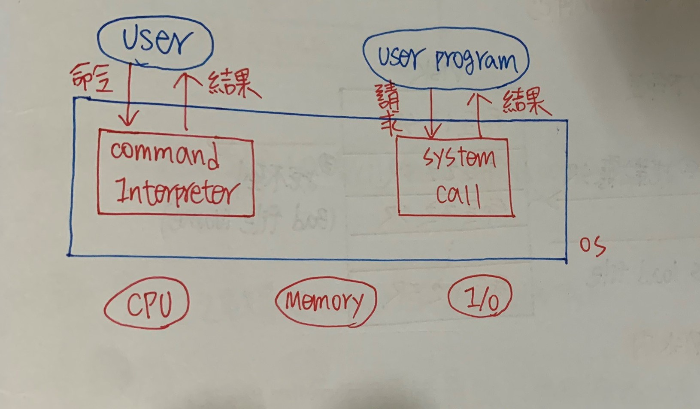

CH3 作業系統架構
======

### OS的User Interface(使用者介面)

+ 所有的程式(包含OS)都有User Interface

+ OS的服務是User和User Program

    + Command Interpreter(命令執譯器)

    + System Call(系統呼叫)



### Command Interpreter(命令執譯器) 作為User和OS溝通介面

+ 接收User的Input命令(User Command)

+ 解釋並判斷命令是否正確

    + 正確 :可啟動相對應Service Routine執行

    + 不正確 :會有Bad Command等錯誤訊息發生

+ 將結果呈現給User

```
Command Interpreter設計或製作考量

1. Command Interpreter是否包含Service Rountine(服務程式)

2. Command Interpreter和OS Kernel Module關聯

```

### Command Interpreter是否要包含Service Routine

+ 分開Command Interpreter和Service Routine

    + 所有Service Routine以File方式存在Storage System(即Disk中)

    + Command Interpreter只扮演Loader腳色


+ **優點 :**

    + Service Routine不會占用太多Memory Space

    + 命令增/刪容易，不會影響OS的Limit

    + 不同User可創造不同User Environment(使用者操作環境)

+ **缺點 :**

    + 命令執行慢(要增加Load File和Disk I/O Time)


+ 合併Command Interpreter和Service Routine


+ **優點 :**

    + 命令執行快(OS載入Memory時將Command Interpreter和所有SR載入Memory中)

+ **缺點 :**

    + 命令之數量受限Command Interpreter大小

    + 無法增刪命令，彈性度低(要增刪OS要重新Compile)

+ 在Dos環境中是採用2種做法混合(經常使用到命令副程式成為Command Interpreter一部分)，所以當下錯指令時會出現

    + Bad Command or File Name

### Command Interpreter和OS Kernel Module關聯程度

+ 合併Kernel(緊密結合) Ex: Window系列


**缺點 :Command Interpreter變更，OS也會變更**

+ 分開Kernel(鬆散耦合)

    + Shell可任意更改，不會影響Kernel，即User Interface變更不會影響OS的Kernel

    + 每個User可以建立自己的Shell


**缺點 :相同命令名稱格式，在不同User Environment(用戶環境)有不同解釋，可能造成誤用**

### System Call(系統呼叫) :作為User Program和OS的溝通介面

+ 當User Program執行時，若需要OS提供Service，則透過發出System Call通知OS,由OS執行相對應Service Routine，以完成其要求服務(I/O Service等)

+ System Call會扮演一個Trap，從User Mode切換到Monitor Mode

```
System Call類型分成以下幾種:  1.行程控制(Process Control)
                             
                             2.檔案管理(File Management)

                             3.裝置管理(Device Management)

                             4.資訊維護(Information Maintenance)

                             5.通信(Communication)

```

+ 通常User看不到這些System Call細節，因為透過In-Line或Run Time Support System的方式為大多數程式語言提供一個簡單介面


### 使用System Call實例

+ 寫一個程式，從一個檔案讀取Data，Copy到另一個檔案

```
1. 程式要知道輸入和輸出檔案名稱 : 在Screen顯示訊息或從Keyboard讀取字元作為檔案名稱

2. 打開輸入檔案，並建立輸出檔案 :有一系列反應正常或錯誤狀況的System Call

3. 讀取輸入檔案Data，Data會寫到輸出檔案 :每次讀寫都必須回傳狀態消息以便注意各種錯誤狀況

4. Close兩個檔案(System Call)

5. 正常終止程式(System Call)

```

### System Call的參數如何傳到OS

+ 方法一 :利用Register(暫存器)儲存這些參數

    + **優點 :速度快(不用Memory存取)**

    + **缺點 :不適合多個參數(Register容量小、貴)**

+ 方法二 :將參數用Table或Block的方法存入Memory中，同時利用一個Register紀錄，此Table或Block的起始位址，傳給OS

    + **優點 :適用參數較多的狀況**

    + **缺點 :速度慢**

+ 方法三 :利用System Stack(堆疊)，要存放參數時，將其Push到Stack，再由OS從Stack中取出參數

    + **優點 :適合參數資料多**

    + **缺點 :Stack Size要夠大，不然會Overflow**

**方法2和方法3不會限制參數數量或長度**

### Microkernel(微核心)

+ 從kernel移走一些非必要Module，這些Module交由System Program或User Program製作，如此可具有較少Module Kernel稱之


+ 一般而言Microkernel保有功能有

    + Basic Process Management(基本流程管理)

    + Basic Memory Management(基本內存管理)

    + Process Communication(程序溝通)(EX :Message Passing)

+ MicroKernel的主要功能提供Client User Program和同樣使用者空間執行其他Server，彼此之間通訊便利(經由訊息傳遞(Message Passing)提供通訊)


+ 優點 :

    + OS擴充容易

        + 所有新加入的System Service都是放到User Mode上執行，所以不會影響Kernel，就算有也是小幅度修改

        + 所得OS易從一個硬體平台轉到另一個

    + 確保性 

        + 大部分System Service都在User Mode執行，一旦Fail，也不會影響System其他部分

### 虛擬機器(Virtual Machine)

+ 透過軟體模擬的機制，創造一份和底層Hardware一模一樣介面，稱Virtual Machine(VM)

+ 利用CPU Scheduling技術創造多顆CPU效果

+ 透過Virtual Memory技術，擴大Memory Space，創造更多空間

+ 透過Spooling技巧，提供多套I/O Device，達I/O Device共用目的

```
虛擬機器最主要概念是希望每個在電腦系統中的使用者都認為自己有一整部電腦，且這部電腦資源都是由一人獨享，甚至隨時可重開

機，但是對真正的System而言，Virtual Machine的OS只是一個正在執行中的User Program(開發OS比較安全)，且效能沒有真正

System好(畢竟是虛擬)
```


### VM軟體在Monitor Mode下執行

+ 優點 :

    + 對於OS的測試和開發是一個很好工具

        + 測試OS可在Virtual Machine上執行，而其他User和User Program仍可在其他Virtual Machine或實際機械上執行，不會終止

        + 因為Virtual Machine是Isolated(隔離)，所以在OS開發或測試過程引發不當錯誤，也不會對真實OS危害

    + Virtual Machine具有安全性

    + 同一部(實體)Machine可執行多套OS

+ 缺點 :

    + 製作困難(要將底層硬體運作精準的Copy很困難)

    + Virtual Machine之間非常Isolate，所以不易溝通和資料共享(要借用Virtual Message Passing技術)


### 為何製作Virtual Machine困難?


```
當VM User Mode有I/O請求時，此時要透過Mode Bit轉成VM Monitor Mode，但VM User和VM Monitor都屬於User Program，因此

要用到Monitor Mode去取資料，在回傳User Mode，在傳回VM Monitor Mode，VM Monitor在傳回VM User Mode

VM User --> VM Monitor-->Monitor-->User Mode-->VM Monitor-->VM User
```

### 系統呼叫類型

+ 行程控制(Process Control)

    + 正常結束、終止執行(End,Abort)

    + 載入、執行(Load、Executed)

    + 建立行程、終止行程(Creat Process、Terminate Process)

    + 獲取行程屬性、設定行程屬性(Get Process Attributes，Set Process Attributes)

    + 等待時間(Wait For Time)

    + 等待事件、顯示事件(Wait Event、Signal Event)

    + 配置和釋放記憶體(Allocate And Free Memory)

+ 檔案管理(File Management)

    + 建立檔案、刪除檔案(Creat File、Delete File)

    + 開起、關閉(Open、Close)

    + 讀出、寫入、重定位置(Read、Write、Reposition)

    + 獲取檔案屬性、設定檔案屬性(Get File Attributes、Set File Attributes)

+ 裝置管理(Device Management)

    + 要求裝置、釋回裝置(Request Device、Release Device)

    + 讀出、寫入、重定裝置(Read、Write、Reposition)

    + 獲取裝置屬性、設定裝置屬性(Get Device Attributes，Set Devicce Attributes)

    + 邏輯上的加入或移去裝置(Logically Attach Or Detach Device)
 
+ 資訊維護(Information Maintenance)

    + 取得時間或日期、設定時間或日期(Get Time Or Date、Set Time Or Date)

    + 取得/設定系統資料(Get/Set System Data)
    
    + 取得行程/檔案/裝置屬性(Get Process，File，Device  Attributes)

    + 設定行程/檔案/裝置屬性(Set Process，File，Device  Attributes)

+ 通信(Communication)

    + 建立/刪除通信連接(Creat/Delte Communication Connection)

    + 傳送/接收訊息(Send/Recieve Message)

    + 傳輸狀況訊息(Transfer State Information)

    + 連接/分離遠程裝置(Attach/Detach Remote Device)

### 電腦開機程序


+ 開機時，執行Bios以進行各Hardware Device之測試、初始設定

+ 進行靴帶載入程式(Bootstrap Loader)

+ 由Bootstrap Loader找到OS的Kernel在哪

+ 將Kernel載入RAM(Monitor Mode)

+ 利用Kernel執行系統初始工作

+ 初始完後將System Control交給User(User Mode)

### Bios(Basic Input/Output System)

+ 電腦開機時必須調用內建程式

+ 提供電腦個硬體周邊裝置中斷服務

+ 對各周邊Device進行初始設定和基本檢測工作(即電源開啟自我檢測Post)，以保證電腦正常運作

EX: 確認RAM大小、硬體組件(Disk、Display、Keyboard等)，若發現有問題發出警示提醒User

### Bootstrap Loader

+ 小程式開機執行

+ 存放在ROM中

+ 用來找OS Kernel，使System可以順利開機

