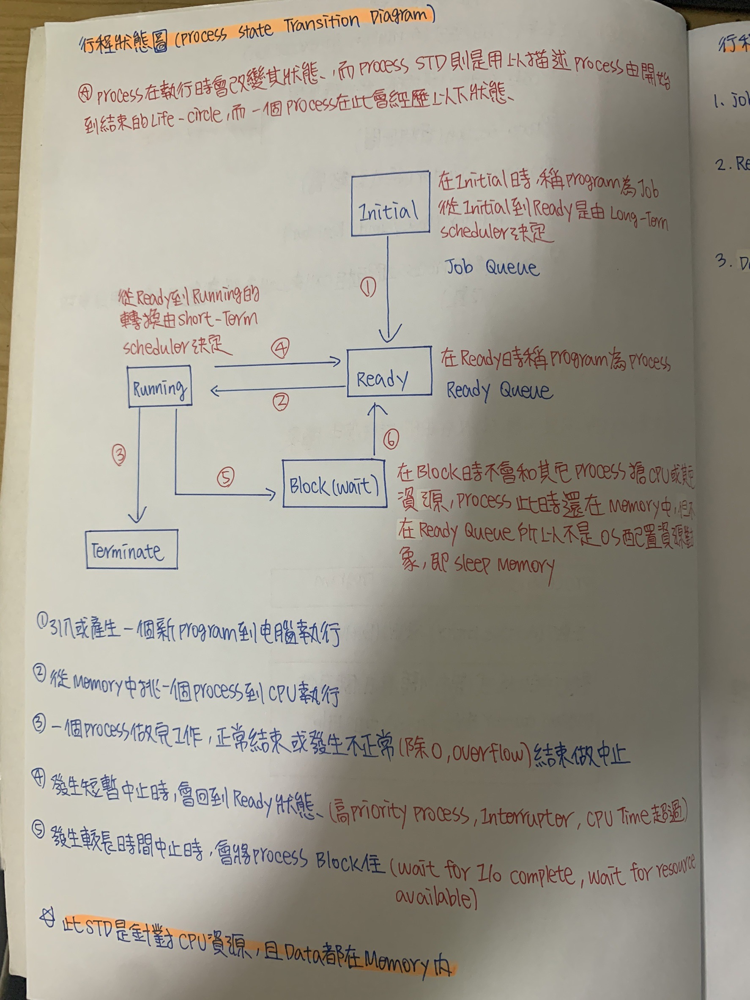
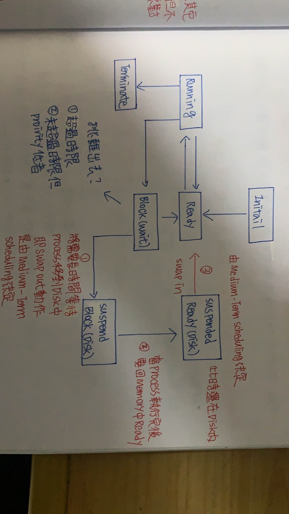

ch4 行程控制 (process management)
======
### process跟program比較
+ ``` process :正在執行的程式，一個process主要有幾個組成```
    
     ``` 
     1.Code Section(程式碼、程式碼區間)

     2.Data Section(資料區間)

     3.program counter(程式計數器)

     4.Cpu Register(Base/Limit Register)

     5.Stack(多個process之間互相call來call去從事遞迴工作，用以存放位置) 
     ```

    
+ ```program :儲存在Disk中的資料``` 

### ```行程狀態圖(Process State Transition Diagram)```



### ```行程排班佇列(Process Scheduling Queue)```

    A. Job Queue :由一群位於Disk中，等待進入Memory之Program所集合

    B. Ready Queue :由一群位於Memory中等待執行process所集合，此Queue一般都是用Link-list儲存

    C. Device Queue :由一群等待I/O裝置的Process所形成集合，每個Device本身都有Device Queue來Record不同process請求




