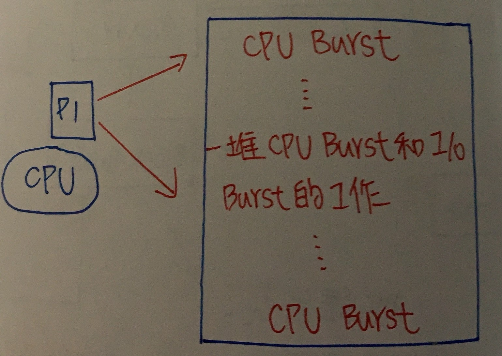

ch4 行程控制 (process management)
======
### process跟program比較
+ ``` process :正在執行的程式，一個process主要有幾個組成```
    
     ``` 
     1.Code Section(程式碼、程式碼區間)

     2.Data Section(資料區間)

     3.program counter(程式計數器)

     4.Cpu Register(Base/Limit Register)

     5.Stack(多個process之間互相call來call去從事遞迴工作，用以存放位置) 
     ```

    
+ ```program :儲存在Disk中的資料``` 

### 行程狀態圖(Process State Transition Diagram)


### 行程排班佇列(Process Scheduling Queue)

    A. Job Queue :由一群位於Disk中，等待進入Memory之Program所集合

    B. Ready Queue :由一群位於Memory中等待執行process所集合，此Queue一般都是用Link-list儲存

    C. Device Queue :由一群等待I/O裝置的Process所形成集合，每個Device本身都有Device Queue來Record不同process請求


```
1. 當Process待在Memory時間太長，或有其他高Priority的Process來搶資源

2. 所等待Long-Time Evevt發生，或花費長時間事情做完了(Long-Time I/O Complete)

3. 將Process從Disk中引入Memory的Ready Queue

```
**此STD是針對Memory這項資源，且Data都在Disk內**

+ 一個Process的執行時間是一連串I/O等待時間和CPU執行時間所組成(因為一個Process除了交給CPU執行外，也可能需要由I/O Device進行資料傳送)

+ 幾乎在每個電腦系統執行Process會在兩種狀態切換
    + CPU Burst Time(CPU Bound Job)
    + I/O Burst Time(I/O Bound Job)



```
Process一開始都是CPU Burst，也就是交給cpu處理Process，接著是I/O Burst，即I/O資料傳送，正常情況下Process會在這兩個

state循環，最後CPU會呼叫System Call來結束Process

```

### 行程控制表(Process Control Block;PCB)   
+ OS為了執行Process Management(行程管理)，將每個Process所相關資訊聚集建立一個Block稱PCB，每個Process都有自己的PCB

+ PCB資訊包含
    + Process ID
    + 處理行程狀態(Process位於Process STD哪個狀態)
    + 程式計數器(指名Process下一個指令位址)
    + CPU暫存器
    + CPU排班資訊(Process priority)
    + Memory管理資訊(Base/Limit Register、Page Table)
    + 帳號資訊(用掉多少CPU，使用CPU最大時間量)
    + I/O狀態資訊(尚未完成I/O Request，I/O Queue中排隊之Process之編號)

+ PCB存在User Area 或Monitor Area?
    + ANS :OS為了管理Process方便，會存一份PCB在OS所在Monitor Area中

### 排班程式種類 
+ Long-Tern Scheduling(Job Scheduling)(**從Job Queue中挑選適合Job到Memory中執行**)
    + 特徵 :

        + 頻率最低
        + 通常適用Batch System，但不是用Real-Time System和Time Sharing System(會有不公平現象，以及執行頻率過低無法及時載入Memory中)
        + 可調控Multiprogramming Dgree，視Memory或CPU使用頻率高或低
        + 可調控I/O Bound 和CPU Bound之混合(可視資源負荷決定載入Job，因為有牽扯Disk) 
 
+ Short-Tern Scheduling(CPU Scheduling)(**從Ready Queue中挑選適合Process，獲得CPU Controller**)
    + 特徵 :

        + 執行頻率最高
        + 每個System都需要(因為每個System都需要CPU)
        + 無法調整Multiprogramming Dgree和I/O Bound、CPU Bound混合(因為是從Memory抓Process到CPU上做執行，無關Disk)

+ Meduim-tern Scheduling中程排班程式(**當Memory Space不夠，又有Process要進入Memory執行，此時Scheduler必須挑選一些Process將其Swap Out到Disk內，等到Memory中有空間再Swap In進來**)

    + 特徵 :

        + 執行頻率介於Long-Time Scheduling和 short-Time Scheduling
        + 用於Time Sharing System(強調公平，所以每個Process執行時間都相同，當有人超過，Swap Out到Disk內) 
        + 可調控Multiprogramming Drgee和I/O Bound、CPU Bound比例(當Long-Tern Scheduling出現誤判或I/O Bound、CPU Bound不平衡，可以從此撈)

### Context Switching(內容轉換)
```
當CPU使用權從一個Process轉移到另一個Process時，必須將舊的Process的相關資訊(PCB)儲存起來，並將新Process相關資訊
    
載到系統中，叫內容轉換
    
```
+ Memory會將要執行Process放到CPU的Register，CPU在自行撈資料

+ Context Switching所花費時間相對來說較浪費
    + 在這過程中系統做的事不具生產力
    + 如果Context Switching次數過多，系統效能可能會不好

+ Context Switching效能速度取決於硬體支援程度(Memory速度、Register數量、特殊機器指令等)


### 如何降低Context Switching ?

+ 方法一 :提供多套Register

```
如果Register數量夠多，則每個Process都可以有自己的Register Set，所以要做Context Switching時，OS只要切換Register 

Set指標到新的Process就好，舊的Process的PDB不用Swap Out到Memory中，也不用從Memory中Swap In新Process PDB，所以不

會用到Memory存取

```
**優點 :速度快**

**缺點 :不適用Register數量少的系統，Register容量小實務上也不常使用此方法**

+ 方法二 :改用Thread代替Process

```
使用Thread(輕量化Process)降低Context Switching負擔，每個Process都有私有訊息(PCB)，這些私有訊息會占用Register，而

Thread之間可以共享Memory(Code Section、Data Section、Open File等)，私有資訊不多，所以從事Context Switching不用

大量Memory Access，可降低Context Switching負擔

```

+ 方法三 :Register有限時

```
當Register有限時，視哪一種Process切換頻繁，User Process和System Process切換頻率最高，因此給User Process和System 

Process一套Register Set，當ser Process和System Process之間Context Switching時，OS只要改變Register Set指標即可
```

### 分派程式(Dispatcher)

```
負責將CPU控制權交給Short-Tern Scheduling所挑出Process功能Model

```
+ 主要工作有三個 :

  + Context Switching
  + Change User Node From Monitor Mode
  + 跳到User Process起始位置以便執行(控制權轉移) 

+ Dispatcher用來停止一個Process，並開始另一個Process所消耗時間，就是Dispatcher Latency(即上述三個時間加總，又稱分派
潛伏或分派延遲)  

**Dispatcher Latency Time越短越好，因為時間越短，可以使新的Process執行時間提早(但總體執行時間不變，只是提早執行)**

### CPU Scheduling(CPU排班)

+ 從行程狀態圖可以看出當CPU IDLE，OS必須從Memory的Ready Queue選一個Process出來

+ 從Memory選Process是由Short-Tern Scheduling執行(OS利用CPU Scheduler，從存放Memory中數個準備執行Process挑出一個，透過Dispatcher將CPU配置給它)

+ 在CPU排班最主要目的就是讓CPU隨時有一個Process執行，提高CPU Utilization

### Scheduling Criteria(衡量排班準則)

+ CPU Utilization(CPU Use Time)/(CPU Use Time+CPU IDLE Time)
    + CPU Use Time :CPU花在Process時間

    + CPU IDLE Time :CPU花在非執行工作時間

+ Throughput(產能) :單位時間能完成Process數

+ Waiting Time(等待時間) 

    + Process待在Ready Queue等待CPU時間總數
    
    + 一個Process真正受到排班法影響標準

+ Turnaround Time(完成時間、回復時間) :一個Task或Process進入System到其完成工作時間

+ Response Time(反應時間) 

    + 自User下命令進入System到System產生第一個反應時間

    + 通常User Interactive(用戶互動)，Time Sharing System中較被要求

### 排班目標

+ CPU Utilization(CPU利用率)**上升**

+ Throughput(產能)**上升**

+ Waiting Time(等待時間)**上升**

+ Turnaround Time(完成時間)**下降**

+ Response Time(反應時間)**下降**

+ Resource Utilization(資源利用率)**上升**

+ Fair(公平) :Process在Ready Queue排隊會不會被插隊

+ No Starvation(飢餓)

### Preemptive(搶先) VS Non Preemptive(不搶先)

+ 不可搶先排班(Non Preemptive)

    + 當Process取得CPU執行時，除非此Process自願將CPU釋放(Process結束工作，Wait I/O)，其他Process才有機會取得CPU，Z否則其他Process無法取得CPU控制權

    + 無法強迫該執行Process放棄CPU

    + 在Process STD中，從Running到Blockc/Terminate都是Non Preemptive

+ 可搶先排班(preemptive)
    
    + 當一個Process取得VPU執行時，可能被迫放棄CPU(High Priority Process進入、中斷發生、CPU Time Slice Expires(CPU執行時間過期)等)，其他Process才有機會取得CPU，否則其他Process無法取得Controler 

    + Process STD中，Running到Ready都是Preemptive

```markdown
    |  Preemptive                       Non Preemptive                  
    | :----------------------------     :----------------------------  
    |  一般而言平均排班效益佳(Waiting     排班效益差(Waiting上升)可能     
    |  Turnaround Time)下降              護衛效應                        
    | :---------------------------      :----------------------------                 
    |  Context Switching次數頻繁         Context Switching次數不頻繁            
    | :----------------------------     :---------------------------- 
    |  Process完成時間不可預期            Process完成時間可預期
    | :----------------------------     :---------------------------- 
    |  平均等待時間短                     平均等待時間長
    | :----------------------------     :---------------------------- 
    |  不會有護衛效應                     有護衛效應
```

**護衛效應 :當有一個長時間占用CPU的Process，會讓總體執行時間增加**

### Starvation(飢餓現象)

```
某些Process因長期無法取得足夠CPU服務來完成工作，造成自身無窮停滯狀態
```
+ 常發生在不公平環境，加上Preemptive則更容易發生
    
    + CPU Scheduling Fair :對每個Process分配很平均

    + CPU Scheduling Not Fair :對每個Process分配不平均

    **解決方法 :**
    
    + 採用Fair Scheduling Algorithm

    + Aging Technique(老化技術) :系統每隔一段時間，會將待在System內長時間未完成工作Process逐步提高Priority Value
    ，因此過一段時間後該Process的Priority最高，取得所需資源完成工作(Soft Real Time不適合)

### Scheduling Algorithm(排班演算法)

+ First Come First Served Scheduling(FCFS)(先到先做排程)
   
    + 特質 :
        + Arrival Time(到達時間)越早Process越先取得CPU控制權
        + 簡單、容易製作 
        + 排班效益最差(Avg.Waiting/Avg Turnaround最長)
        + 會產生Convoy Effect(護衛效應)，再多組Process均等待一個需要長時間完成工作的Process，造成平均等待時間增加
        不良現象
        + Fair
        + Non Starvation
        + Non preemptive
   


+ Short-Job-First Scheduling(SJF)(最短工作優先排程)
    + 特質 :
        + 若Process的CPU Burst Time越少，越先取得CPU控制權
            1. Avg.Waiting Time和Avg.Turnaround Time最小
            2. Response Time不保證，可能會被SJF排在後面
        + 不會有Convoy Effect(因為時間長的Process都被排在後面)
        + Non Fair(因為SJF偏好短的Process)
        + 有可能產生Starvation(Long CPU Time Job都被排在後面)
        + Non Preemptive(可被搶奪的SJF稱SRTF Algorithm)
        + 不能用在Short Tern Scheduling，因為在SJF中，每個Process的Burst Time都是用預估的，要實際知道下一個CPU 
        Burst Time很難，然而Short Tern Scheduling執行頻率即高，它動不動就會挑Job，所以很難在短時間內計算每個Process的CPU Burst Time
        + 可用在Long Tern Scheduling，因為此類執行頻率較低有機會運算


+ Short-Remaining-Time-First Scheduling(SRTF)(剩餘時間最短優先)
    + 特質 :
        + 為Preemptive SJF Scheduling，當Process的Remaining(剩下)時間最小，可以先取得CPU控制權，即新抵達Process的
        CPU Burst Time 小於目前正在執行Process的Remaining Time，則執行中的Process會被迫放棄CPU讓新的Process插入

        + Avg.Waiting Time小於SJF Scheduling
        + Preemptive
        + Context Switching次數比SJF高
        + Non Fair
        + Starvation


+ Priority Scheduling(優先權排班)
    + 特質 :
        + 具有High Priority Process取得CPU控制權
        + Non Fair
        + Starvation
        + 可以是Preemptive或Non Preemptive

  ```markdown
    Preemptive :當某個Process到達Ready Queue會和目前Process筆Priority，若新的Process Priority比較高會搶走
    CPU控制權
                    
    Non Preemptive :當新的Process的Priority比目前Process高，在Non Preemptive環境下，只會將新Process
    放在Ready Queue後端 
    
    ```
    
    + Priority Scheduling關鍵在於優先權定義
        + 內部 VS 外部
            ``` markdown
             內部 :針對每個Process的資源需求，通常是OS控制，如Memory需求、時間限制、Open File數量

                   假設已到達時間決定優先權，則到達時間小，優先權高(退化成FIFO)

                   假設以CPU Burst Time決定優先權，則CPU Burst Time越小，優先權越高(退化成SJF)

            外部 :針對政策面考量，通常由人控制，如(Process的重要性、支付電腦費用等等)
            
            ```
        
        + Static VS Dynamic(靜態 VS 動態)
        ``` markdown
            Static :當Priority設定給Process後就不能更改，如Soft Real Time System

            Dtnamic :當Priority設定給Process可以依需求更改   
            
            ```


+ Round Robin Scheduling(RR)(循序排班演算法)
    + 特質 :
        + OS會規定一個CPU Time Slice，當Process得到CPU控制權，未能在CPU Time Slice執行完成，被迫放棄CPU(Running->Ready)，等待下輪
        + Fair
        + Preemptive
        + Non Starvation
        + RR的排班效益取決CPU Slice Time定義
        ``` markdowm
            CPU Time Slice Large :退化成FIFO

            CPU Time Slice Little :Context Switching太頻繁，CPU Time未真正在使用上，Throughput太低

            因此通常80%工作可以在Time Slice完成最好
            ```
    + 製作 :需要Hardware支援(Timer)
    ```markdown
    當Process取得CPU後，Timer Initail設為Time Slice值，隨Process執行Timer值逐次減少，
    
    當到達0時，會發出Time Out Interrupt通知OS，OS強迫放棄DPU
    ```


+ Multilevel Queue(多層佇列)


    + 每個Queue都有自己的Scheduling Algorithm
    + Queue和Queue之間採Preemptive Priority之排班方法
    + 不允許Process在各Queue之間移動
    
    + 特質 :
        + 根據Process不同特性，將Memory中所形成單一Ready Queue分成不同Priority等級Ready Queue
        + 排班設計/調整靈活度高(可參化項目=>Queue數目、Queue法則、Process放入何種Queue等)
        + No Fair
        + Starvation
        + Preemptive

+ Multilevel Feedback Queue(多層回饋佇列)

+ 作法:
    ```markdown
    採用Aging技術，每隔一段時間，就將Process往上提高到上一層Queue中，所以經過有限時間後，Lower Priority Queue中
    的Process會被放在High Priority Queue，故無Starvation，也可配合降級動作，當上層Queue中Process取得CPU後，
    未能在時間內完成工作，則此Process在放棄CPU後，會被放在下層Queue
    ```
    + 特質 :
        + 排班設計/調整靈活高
        + No Fair
        + No Starvation
        + preemptive

+ Scheduling Algorithm Summary(概括)
    + Preemptive
        + SRJF
        + RR
        + Preemptive Priority
        + Multilevel Queue
        + Multilevel Feedback Queue
    
    + Non Preemptive
        + FCFS
        + SJF
        + Non Preemptive Priority
    
    + Non Starvation
        + FCFS
        + RR
        + Multilevel Feedback Queue
    
    + Fair
        + FCFS
        + RR

    
**公平可插隊不會Starvation的Scheduling是 Round Robin**

**唯一可插隊不會Starvation的Scheduling是Multilevel feedback Queue**

