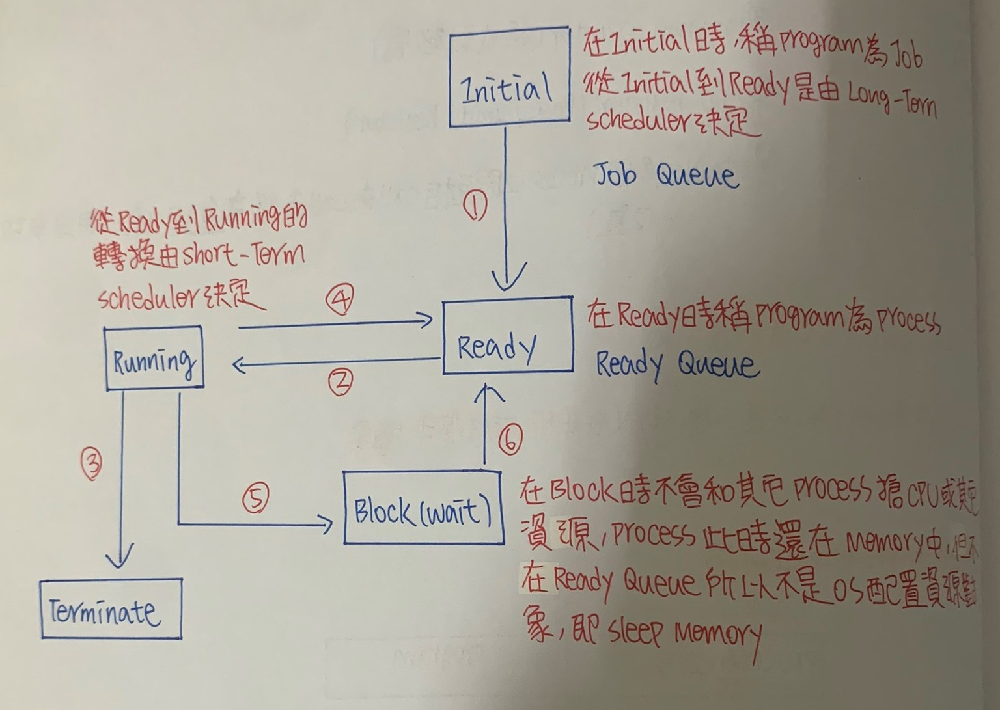

ch4 行程控制 (process management)
======
### process跟program比較
+ ``` process :正在執行的程式，一個process主要有幾個組成```
    
     ``` 
     1.Code Section(程式碼、程式碼區間)

     2.Data Section(資料區間)

     3.program counter(程式計數器)

     4.Cpu Register(Base/Limit Register)

     5.Stack(多個process之間互相call來call去從事遞迴工作，用以存放位置) 
     ```

    
+ ```program :儲存在Disk中的資料``` 

### 行程狀態圖(Process State Transition Diagram)



### 行程排班佇列(Process Scheduling Queue)

    A. Job Queue :由一群位於Disk中，等待進入Memory之Program所集合

    B. Ready Queue :由一群位於Memory中等待執行process所集合，此Queue一般都是用Link-list儲存

    C. Device Queue :由一群等待I/O裝置的Process所形成集合，每個Device本身都有Device Queue來Record不同process請求


```
1. 當Process待在Memory時間太長，或有其他高Priority的Process來搶資源

2. 所等待Long-Time Evevt發生，或花費長時間事情做完了(Long-Time I/O Complete)

3. 將Process從Disk中引入Memory的Ready Queue

```
**此STD是針對Memory這項資源，且Data都在Disk內**

+ 一個Process的執行時間是一連串I/O等待時間和CPU執行時間所組成(因為一個Process除了交給CPU執行外，也可能需要由I/O Device進行資料傳送)

+ 幾乎在每個電腦系統執行Process會在兩種狀態切換
    + CPU Burst Time(CPU Bound Job)
    + I/O Burst Time(I/O Bound Job)


```
Process一開始都是CPU Burst，也就是交給cpu處理Process，接著是I/O Burst，即I/O資料傳送，正常情況下Process會在這兩個

state循環，最後CPU會呼叫System Call來結束Process

```

### 行程控制表(Process Control Block;PCB)   
+ OS為了執行Process Management(行程管理)，將每個Process所相關資訊聚集建立一個Block稱PCB，每個Process都有自己的PCB

+ PCB資訊包含
    + Process ID
    + 處理行程狀態(Process位於Process STD哪個狀態)
    + 程式計數器(指名Process下一個指令位址)
    + CPU暫存器
    + CPU排班資訊(Process priority)
    + Memory管理資訊(Base/Limit Register、Page Table)
    + 帳號資訊(用掉多少CPU，使用CPU最大時間量)
    + I/O狀態資訊(尚未完成I/O Request，I/O Queue中排隊之Process之編號)

+ PCB存在User Area 或Monitor Area?
    + ANS :OS為了管理Process方便，會存一份PCB在OS所在Monitor Area中

### 排班程式種類 
+ Long-Tern Scheduling(Job Scheduling)**從Job Queue中挑選適合Job到Memory中執行**
    + 特徵 :

        + 頻率最低
        + 通常適用Batch System，但不是用Real-Time System和Time Sharing System(會有不公平現象，以及執行頻率過低無法及時載入Memory中)
        + 可調控Multiprogramming Dgree，視Memory或CPU使用頻率高或低
        + 可調控I/O Bound 和CPU Bound之混合(可視資源負荷決定載入Job，因為有牽扯Disk) 
 
+ Short-Tern Scheduling(CPU Scheduling)**從Ready Queue中挑選適合Process，獲得CPU Controller**
    + 特徵 :

        + 執行頻率最高
        + 每個System都需要(因為每個System都需要CPU)
        + 無法調整Multiprogramming Dgree和I/O Bound、CPU Bound混合(因為是從Memory抓Process到CPU上做執行，無關Disk)

+ Meduim-tern Scheduling中程排班程式**當Memory Space不夠，又有Process要進入Memory執行，此時Scheduler必須挑選一些Process將其Swap Out到Disk內，等到Memory中有空間再Swap In進來**

    + 特徵 :

        + 執行頻率介於Long-Time Scheduling和 short-Time Scheduling
        + 用於Time Sharing System(強調公平，所以每個Process執行時間都相同，當有人超過，Swap Out到Disk內) 
        + 可調控Multiprogramming Drgee和I/O Bound、CPU Bound比例(當Long-Tern Scheduling出現誤判或I/O Bound、CPU Bound不平衡，可以從此撈)

### Context Switching(內容轉換)
```
當CPU使用權從一個Process轉移到另一個Process時，必須將舊的Process的相關資訊(PCB)儲存起來，並將新Process相關資訊
    
載到系統中，叫內容轉換
    
```
+ Memory會將要執行Process放到CPU的Register，CPU在自行撈資料

+ Context Switching所花費時間相對來說較浪費
    + 在這過程中系統做的事不具生產力
    + 如果Context Switching次數過多，系統效能可能會不好

+ Context Switching效能速度取決於硬體支援程度(Memory速度、Register數量、特殊機器指令等)


### 如何降低Context Switching ?

+ 方法一 :提供多套Register

```
如果Register數量夠多，則每個Process都可以有自己的Register Set，所以要做Context Switching時，OS只要切換Register 

Set指標到新的Process就好，舊的Process的PDB不用Swap Out到Memory中，也不用從Memory中Swap In新Process PDB，所以不

會用到Memory存取

```
**優點 :速度快**

**缺點 :不適用Register數量少的系統，Register容量小實務上也不常使用此方法**

+ 方法二 :改用Thread代替Process

```
使用Thread(輕量化Process)降低Context Switching負擔，每個Process都有私有訊息(PCB)，這些私有訊息會占用Register，而

Thread之間可以共享Memory(Code Section、Data Section、Open File等)，私有資訊不多，所以從事Context Switching不用

大量Memory Access，可降低Context Switching負擔

```

+ 方法三 :Register有限時

```
當Register有限時，視哪一種Process切換頻繁，User Process和System Process切換頻率最高，因此給User Process和System 

Process一套Register Set，當ser Process和System Process之間Context Switching時，OS只要改變Register Set指標即可
```

### 分派程式(Dispatcher)

```
負責將CPU控制權交給Short-Tern Scheduling所挑出Process功能Model

```
+ 主要工作有三個 :

  + Context Switching
  + Change User Node From Monitor Mode
  + 跳到User Process起始位置以便執行(控制權轉移) 

+ Dispatcher用來停止一個Process，並開始另一個Process所消耗時間，就是Dispatcher Latency(即上述三個時間加總，又稱分派
潛伏或分派延遲)  

**Dispatcher Latency Time越短越好，因為時間越短，可以使新的Process執行時間提早(但總體執行時間不變，只是提早執行)**

### CPU Scheduling(CPU排班)