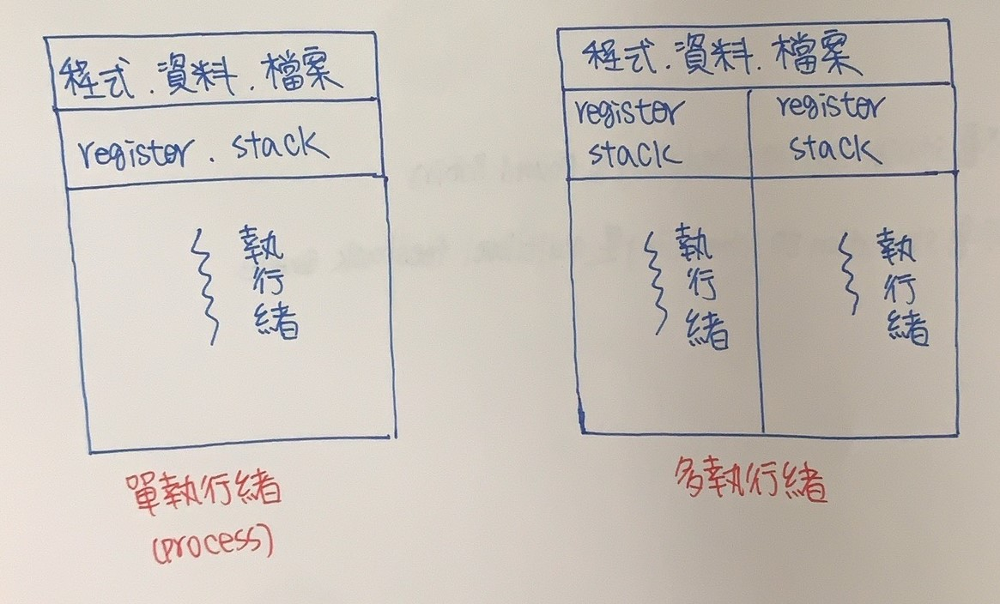
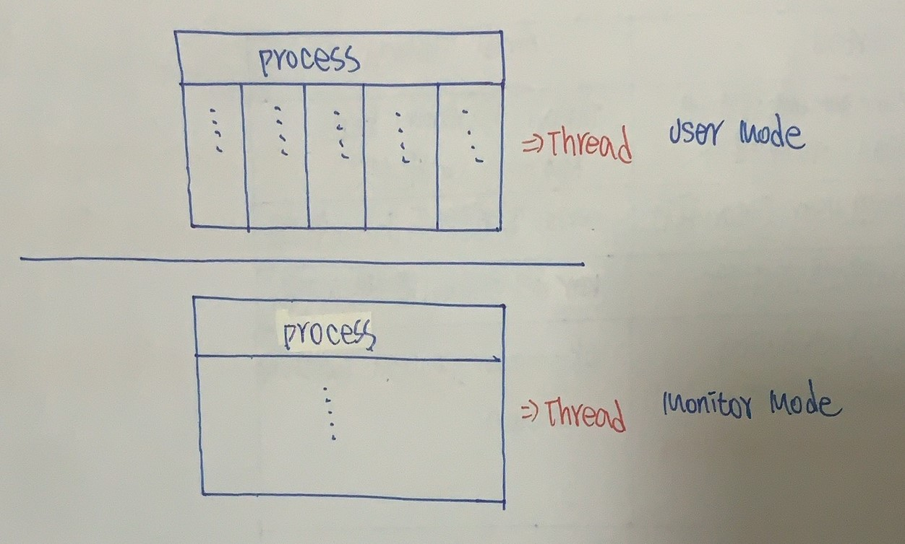
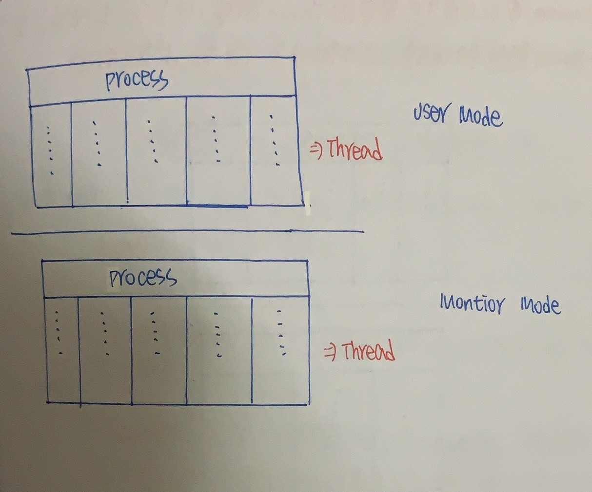
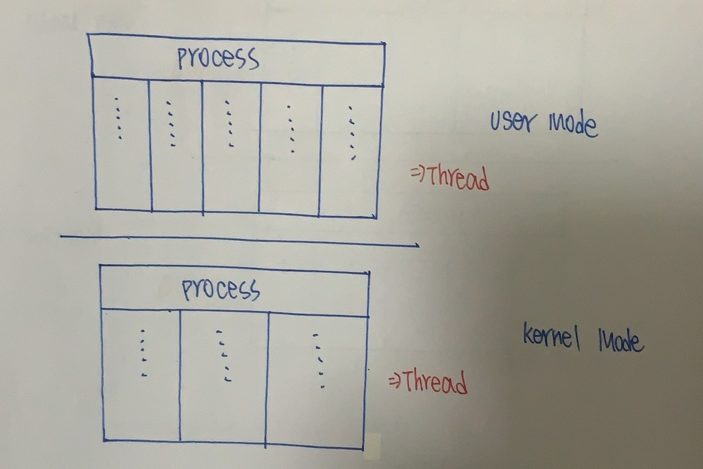

CH5 執行緒(Thread)
======

### 執行緒

+ 又稱Lightweight Process(輕量級行程)，是OS分配CPU Time對象，和Process相同會搶奪CPU Resource

+ 每個Thread擁有以下
    + Thread ID(執行緒識別碼)
    + Thread State
    + Program Counter(Thread也是一段程式)
    + Register Set
    + Stack

+ 同一個Task(Process)內Thread彼此共享
    + Code Section(程式碼區域)
    + Data Section(資料區域)
    + OS Resource(作業系統資源)

+ 傳統Process(Heavyweight Process)等同於一個Task內只有一個Thread 


+ Process和Thread只有內部OS看的出來，外部看不出來

```markdown
    |           Thread                             Process                
    | :----------------------------     :----------------------------  
    |  Lightweight Process               Heavtweight Process                             
    | :---------------------------      :----------------------------                 
    |  同一個Task內的Thread可以共享       不同Process無共享Address，
    |  Data Section、Code Section        Space互相獨立
    |  OS Resource     
    | :----------------------------     :---------------------------- 
    |  Context Switching負擔輕           Context Switching負擔重
    | :----------------------------     :---------------------------- 
    |  Thread Management成本低           Process Management成本高
    | :----------------------------     :---------------------------- 
    |  Process內某個Thread被Block住，    Process單一Thread被Block，整個
    |  可以切換到其他Thread執行           Process Block住
    | :----------------------------     :---------------------------- 
    |  能用Multiprocessor架構效益，因    較無法發揮SMP之Paealler Process
    |  為同一Process的不同Thread可在     效益
    |  不同CPU上執行
    | :----------------------------     :---------------------------- 
    |  必須對Share Data的Mutex取得控     Proceess之間無共享
    |  制，防止不正常Thread危害
```

### Benefits(利益)
+ Responsiveness(應答) :多執行緒在一個交談互動的應用中，允許程式某一部分被中斷或執行非常久，該Process仍可以執行
(一個Process只要還有一個Thread，該Process可在執行)

+ Resouece Sharing(資源分享) :執行緒中共用它們所屬Process的Memory和Resource

+ Economt(經濟) :採用執行緒，因為執行緒所產生和從事Context Switching共用他們所屬Process的Memory和Resource，實際執行較經濟

### Utilization of MP Architecture(使用多處理器架構)
+ 如果是在多處理器架構下實行多執行緒，因為每個執行緒可以併行在不同處理器上執行，因此多執行緒利益可大幅提升

+ 在單一處理器架構下，CPU讓每個Thread快速切換移動，讓User以為同時進行

### Thread種類

+ 分類角度 :Thread Management(Context Switching、Creation Scheduling)由誰控制

+ 執行緒可以依據所處模式不同分成2種
    
    + The User Level :User Thread在User Mode下進行，OS不知道有這些Thread，且不需要OS介入

    + The Kernel Level :Kernel Thread在Monitor Mode下進行，OS知道這些Thread存在，由OS控制

```markdown
    |        User Thread                       Kerel Thread               
    | :----------------------------     :----------------------------  
    |  Thread Management是由使用者        Thread Management是由Kernel
    |  的Thread Library提供               所提供
    | :---------------------------      :----------------------------                 
    |  Kernel不知道Thread存在            Kernel掌控所有Thread管理     
    | :----------------------------     :---------------------------- 
    |  User Thread管理成本低             Kernel Thread管理成本高
    | :----------------------------     :---------------------------- 
    |  優 :Thread的Scheduling，Context    缺 :Slower Context Switching
    |      Switching不用Kernel介入(           Creation
    |      Fast Context Switching、
    |      Creation)
    | :----------------------------     :---------------------------- 
    |  缺 :當User Thread發出System Call   優 :Thread發出System Call不會
    |      且Kernel是Single Thread，會        使整個Process Block
    |      導致整個Process Block                
    |                                        可安排不同Thread在不同CPU上
    |      無法有效利用Multiprocessor         平行執行，發揮Multiprocessor
    |      功能                               效益
```

### Multithreading Models(多執行緒模式)

+ Many-To-One-Model(多對一模式)
    
    + 多對一模式是指多個User Threads對應到一個Kernel Thread

    + 執行緒主要管理動作是在使用者空間執行，所以很有效率

    + 缺點如果有任何一個User Level的Thread有System Call將會造成整個Process暫停

    + 雖然這模式可以產生它所需要Thread數量，但因為只有一個Kernel Thread可以存取Kernel，OS一次只能使用一個Thread，
    且OS不知道這些User Thread存在，無法將Block以外的Thread分配給處理器，所以多個Thread不能再多處理器上並行執行 



+ One-To-One Model(一對一模式)
    
    + 每一個User Thread都對應到一個Kernel Thread，當User Thread處於暫停狀態或Wait狀態，其他Thread可以繼續執行 

    + 它比多對一模式提供並行功能，也允許多個Thread在Multiprocessor上並行執行

    + 產生一個User Thread時，會連帶產生一個Kernel Thread，而Kernel Thread會對程式執行產生揖謝額外負擔(所以此模式限制Thread個數)


+ Many-To-Many Model(多對多模式)

    + 多個User Thread可對應到少於或等於User Thread個數的Kernel Threads

        + Many-To-One Model可以產生它所需要Thread數量，但因為Kernel一次只能執行一個Thread，所以數個Thread不能真正的在多處理器下環境執行

        + One-To-One Model雖然可以提供較強並行功能，但不能產生太多Thread

    + Programmer或OS可產生所需Thread數量，使其在多處理器上並行執行，另外當一個Thread暫停執行時，OS可以安排另一個Thread接續執行


### Thread Pool(執行緒池)
+ 當OS收到一個要求，就產生一個個別Thread來服務此要求

+ Multithread可產生很多Thread，但產生Thread很花時間，如果無限制產生可能耗盡系統資源

+ 解決方法利用Thread Pool
    
    + 當一個Process執行時，產生一些Thread，將這些Thread放到一個Pool等待工作

    + 當有一個工作要求產生時，從Pool中喚醒一個Thread給要求者執行所需工作

    + 工作完後Thread回到Pool內等待其他工作

    + 如果一個工作產生，Pool內沒有Thread可執行，這個工作就要等待到有為止

+ Thread Pool好處
    
    + 對一個服務要求而言，使用現存Thread比等待產生Thread較來的快

    + Thread Pool限制任何時間點上Thread個數，不會讓系統資源耗盡(Pool中沒有Thread不會產生新的)，對於資源系統很重要

+ Thread Pool中數量可根據
    + CPU個數

    + 實體Memory大小
    
    + 預期客戶要求數目