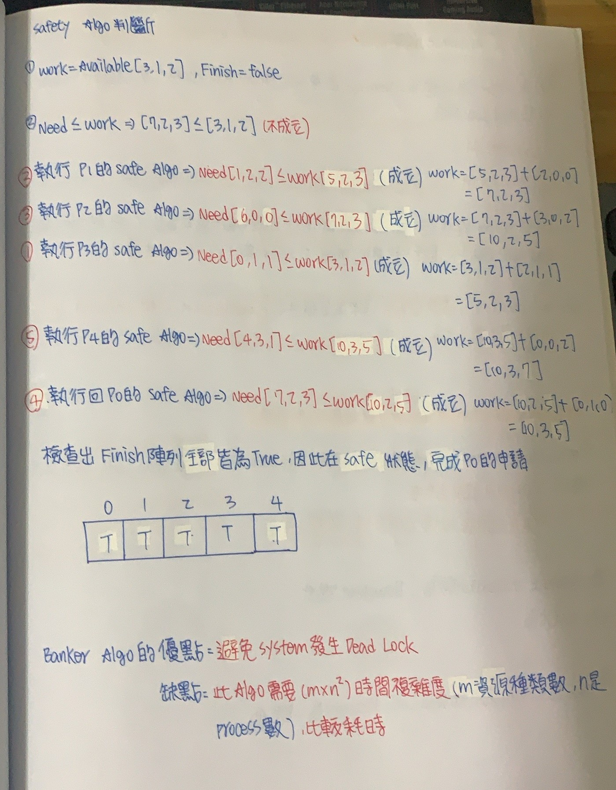
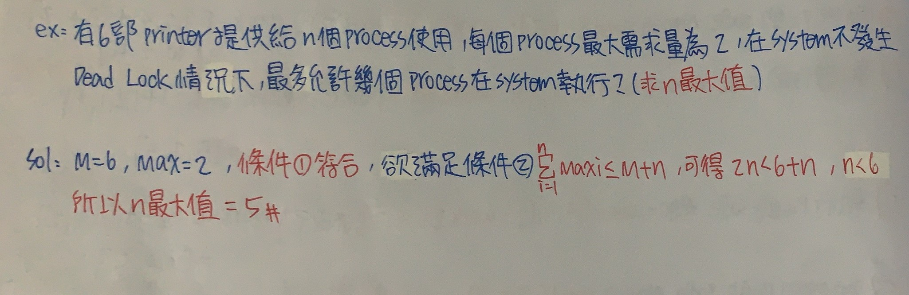

CH6 死結(Dead Lock)
======

### Dead Lock
+ 系統存在一組Process陷入**互相等待對方所擁有Resource**的情況(Circular Waiting)，造成所有Process皆無法往下執行，使CPU的Utilization和Throughput降低


+ Dead Lock VS Starvation
    
    + 共同點 :皆為System Resource分配不當造成

    + 相異點 :
    ```markdown
    |           Deak Lock                      Starvation                   
    | :----------------------------     :----------------------------                 
    |  由一組Process形成Circular          由單一或少數Process長期無法
    |  Waiting造成所有Process Block住     取得資源，但其他Process仍可
    |                                     正常執行
    | :----------------------------     :---------------------------- 
    |  CPU Utilization和Throughput低     CPU Utilization和Throughput
    |                                    不一定低  
    | :----------------------------     :---------------------------- 
    |  常發生在Non Preemptive內           常發生在Preemptive，或不公平
    | :----------------------------     :---------------------------- 
    |  Process內某個Thread被Block住，    Process單一Thread被Block，整個
    |  可以切換到其他Thread執行           Process Block住
    | :----------------------------     :---------------------------- 
    |  解決 :有三大處理方法               解決 :利用Aging技術
 
    ```

### 形成Dead Lock的4大條件(缺一不可)

+ Mutual Exclusion(互斥) :某些資源在一個時間點只能給一個Process做使用，不能有多個Process同時使用此資源，其他想使用此資源的Process需等待，直到該Process被釋放(EX: CPU、Printer)

+ Hold And Wait(持有並等待) :Process持有部分資源，且等待其他Process所持有資源

+ Non Preemptive(不可搶先) :Process不可搶奪其他Process所持有資源，需等待其他Process自願釋放這些資源才可用

+ Circular Waiting(循環式等待) :System存在多組Process(P0、P1、P2、P3)，其中P0在等待P1所持有Resource，P1在等待P2所持有Resource，P2在等待P3所持有Resource，P3在等待P0所持有Resource，P0~P3形成Circular Waiting

### Dead Lock處理方法

+ Dead Lock Prevention(死結預防)

+ Dead Lock Avoidance(死結迴避)

+ Dead Lock Detection && Recovery(死結檢測和恢復)

### Dead Lock Prevention(死結預防)  打破4大條件其中之一就保證死結不會發生

+ 打破Mutual Exclusion

    + 很困難
    
    + 因為互斥是某些Resource與生俱來性質，無法打破

+ 打破Non Preemptive :允許Process搶奪其他Waiting Process的資源(即Preemptive)，頂多只會有Starvation，但無Dead Lock

+ 打破Hold And Wait

    + 規定Process可以一次取得完成工作Resource，才允許Process持有資源，否則Process不能持有任何資源
    (若一次全拿，Wait不成立，若全都不拿，Hold不成立)

    + 規定Process在執行時可以持有部分資源，但若要申請新資源，必須先將手上資源釋放，才能申請
    (一開始部分拿，Wait不成立，釋放手中資源，Hold不成立)

+ 打破Circular Waiting :OS要採取下列措施

    + 為每個不同類型Resource分配一個獨一無二的資源編碼(Unique ID)

    + 規定Process必須按照資源編號遞增/遞減方式提出申請


**優點 :系統絕對不會有Dead Lock發生**

**缺點 :Resource Utilization和Throughput低**

### Dead Lock Avoidance(死結避免)

+ 當Process提出對資源申請時，OS會根據以下資訊執行銀行家演算法來判斷System，假設核准申請在Unsafe，Process必須等一段時間再申請一次

```
1.申請Resource數量

2.各Process目前持有Resource數量

3.各Process尚需要Resource數量

4.System目前可用Resource數量
```


### Banker Algorithm(銀行家演算法)

+ 針對提出資源申請Process，來檢視系統是否因此接受此一系列申請進入死結

+ 使用到資料結構(架設系統有N個Process，M種Resource)

    + Request i[1....M]一維陣列 **要求多少資源**
        
        + 表示Process所提出資源申請量

        + Request i[j]=K，表示Process 要申請K個類型為j的資源

    + Allocation [1...N][1...M]二維陣列 **手拿多少Resource**
        
        + 表示各Process目前持有資源數量

        + Allocation[i,j]=K，表示Process i目前持有類型j的資源有K個

    + Max[1...N][1...M]二維陣列 **總共需要多少Resource**

        + 表示各Process需要哪些資源，且需要多少數量才能完成工作(即記錄各類資源最大需求量)

        + Max[i,j]=K，表示Process i需要有類型j的Resource，且最多需要K個才能完成工作
    
    + Need[1...N][1...M]二維陣列 **還需要多少Resource**

        + 表示Process目前尚需要多少數量資源才能完成工作

        + Need[i,j]=K，表示Process i需要類型j的資源K個才能完成工作

        + Need i=Max i-Allocation i
    
    + Available[1...M]一維陣列 **剩多少Resource**

        + System目前各資源可用數量

        + Available=系統資源總量-Allocation

### Banker Algorithm之解題步驟

+ 1.檢查Request i<= Need i，即檢查所提出要求合不合理，若不成立，OS會視為Illegal，終止Process，若成立Goto 2

+ 2.檢查Request i<= Available，即檢查System是否有足夠的資源提供給Process，若不成立，則Process必須等到資源足夠才行
若成立Goto 3

+ 3.(假設性試算)假設System分配Resource給提出申請之Process，透過下列計算數值已做接下來安全演算法分析

    + Available = Available-Request i(分配後系統還有多少資源可以用)

    + Need i= Need i-Request i(分配後Process i還需要多少資源才能完成工作)

    + Allocation = Allocation i+Request i(分配後Process i掌握多少資源)

+ 4.執行Safe Algorithm(安全演算法)，若System判斷處於Safe State，允許申請，否則否決這次申請，稍後再申請

### Safe Algorithm(安全演算法)

+ 所用到資料結構(假設System有N個Process和M種Resource)
    
    + Work[1...M]一維陣列

        + 假設配置資源後，目前系統可工作的資源數量累計

        + 初值 = Available

    + Finish[1...N]of Boolean 一維陣列

        + Finish[i]表示Process[i]完成與否(True完成，False未完成)

        + 初值 Finish[i] = False，因為Process不可能一開始不用任何資源就完成
    
### Safety Algorithm解題步驟

+ 1.設定初值

    + Work = Available(分配後的 System Resource還有多少，繼承前一個演算法的Available結果)

    + Finish[i] = Flase

+ 2.找出一個Process i滿足
    
    + Need i<= Work

    + Finish[i] = False

    + 若找到**Goto 3**，否則**Goto 4**

+ 3.設定Finish[i] = True和Work = Work + Allocation(把資源還給系統)，**Goto 2**

+ 4.檢查Finish陣列，若全部都為True，則系統處於Safe State，否則處於Unsafe State


**若可以找出一組Process執行順序，讓所有Process完成，此順序稱Safe Sequence(表示資源分配釋放都OK)**




### Dead Lock Avoidance的重要定理

+ 假設System包含M種單一Resource，且被N個Process共用，如果下列2個條件滿足則無Dead Lock存在

    + 1 <= Maxi <= M

    + Max[1...M] <= M+N


### Dead Lock Detection && Recovery(死結偵測和恢復)

+ 若Dead Lock Prvention和Avoidance都不用，則System中可能存在Dead Lock，需要以下機制
    
    + 偵測死結是否存在

    + 若死結存在，則打破死結，恢復正常

**優點 :Resource Utilization較高，Throughput提升**

**缺點 :Cost太高**

+ Dead Lock Detection和Dead Lock Recovery為一體的

### Dead Lock Detection Algorithm(死結偵測)

+ 偵測所有Process會不會進入死結，**勿和銀行家演算法搞混**

+ 使用到資料結構(假設System有N個Process和M種Resource)

    + Available[1...M]一維陣列

        + 表示System目前可用資源數
    
    + Allocation[1...N][1...M]二維陣列

        +  表示各Process目前持有資源數量

    + Request[1...N][1...M]二維陣列

        + 表示各Process目前所提出資源申請量

    + Work[1...M]一維陣列

        + 表示目前System可用資源總數(初值 = Available)
    
    + Finish[1...N]of Boolean 一維陣列 初始值設定為 :

        + if Allocation = 0,Finish[i] = True(Process沒有持有任何資源可假設完成，但不代表Process真的完成工作，只是該Process目前沒有持有資源，所以OS認為此時Process不會發生Hold And Wait，故假設Process完成)

        + if Allocation != 0,Finish[i]=False(尚未完成，且Process持有Resource)

+ 處理步驟 :
    
    + 1.設定Work和Finish的初始值

        + Work = Available

        + Finish[i]的初值視Process i有無持有資源決定(if Allocation = 0,else Allocation != 0)

    + 2.找到一個滿足下列2個條件的Process Pi，若找到，**Goto 3**，否則**Goto 4**
        
        + Finish[i]=False(此Process未完成)
        
        + Request[i] <= Work(此Process當下提出申請，System可以應付)
    
    + 3.Finish[i] = True，Work = Work + Allocation  ，**Goto 2**

    + 4.檢查Finish陣列，若皆為True，無Dead Lock，若有部分False，表示System Dead Lock，且Finish[i]=False皆陷入Dead Lock


### Dead Lock Detection Algorithm優缺點

**優點 :可偵測出System是否有Dead Lock存在，若有Dead Lock，可知道那些Process陷入Dead Lock**

**缺點 :此演算法需Cost O(n*n*m)時間複雜度**

### Dead Lock Recovery

+ 終止Process

    + Delete All :這些Process之前做的工作都白費，Cost太高

    + 每次只終止一個Process,直到Dead Lock打破，如每刪一個Process後皆要在執行Dead Lock Detection Algorithm，判斷有無Dead Lock存在，若刪除該Process，Dead Lock仍在，表示該Process白殺，Cost太高(偵測時間O(n*n*m))

+ 資源搶奪

    + 選擇犧牲者Process(Victim Process)

    + 剝奪其資源

    + 恢復到此Victim Process原先無該資源狀態(困難)，因為OS需要Record每個Process每次使用資源狀態

    + 要考量到Starvation問題(可搶奪)，把剝奪次數納入考量，用Aging技術解決

### Resource Allocation Graph(資源分配圖)


