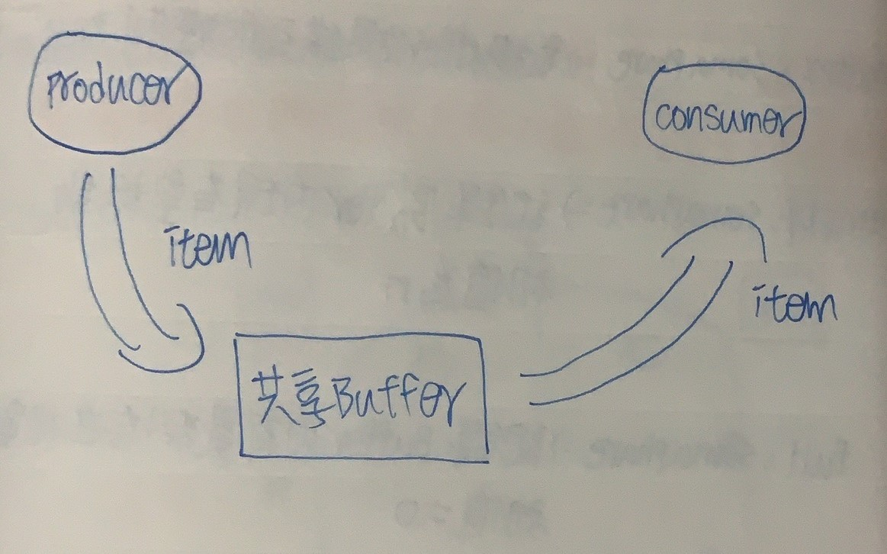
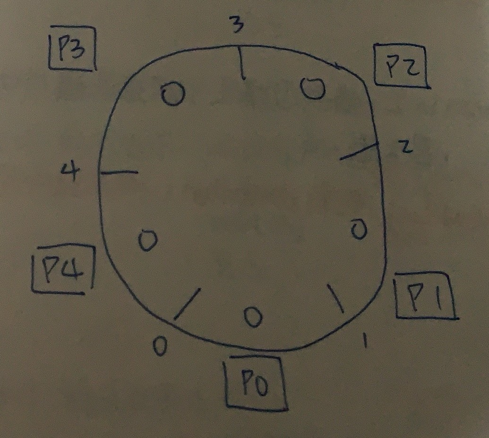
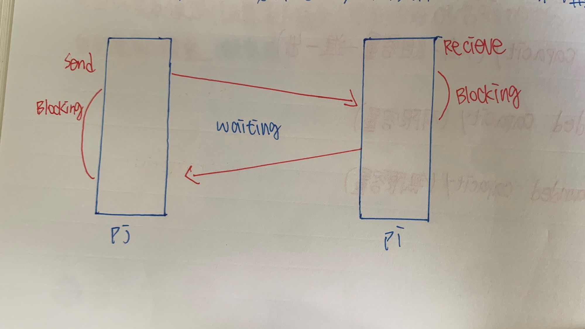

CH7 行程間溝通(Process Management)
======
### 為何Process之間需要溝通
+ 在現行的作業系統中，通常不會只有一種Process存在OS內，一般會有很多個Process同時存在System中並行進行(Concurrent Execution)

+ 存在System中並行執行的Process分成2類

    + 獨立行程(Independent Process) :如果一個Process無法影響其他Process執行，同時它不受其他Process影響，該Process為獨立行程，這類Process不會有任何共享資料

    + 合作行程(Cooperating Process) :如果一個Process能影響其他Process，或受到其他Process影響，它就屬合作行程，這些Process會共同完成一份工作，這類Process會共享資料，彼此需要資料交換和協調管道

+ 獨立的行程因為行程間不會互相影響，且行程間也是個自行完成各自工作，合作行程比較有討論空間

### Process Communication的方式

+ Share Memory方法 :

    + 各Process利用對共享Memory(共享變數)的存取來達到彼此溝通交換資訊

    + 提供對共享Memory之互斥存取控制的責任是由Programmer負責，OS只負責共享Memory空間，不提供額外Resource

+ Message Passing方法 :2個Process要溝通要遵守以下步驟

    + 建立Communication Link(溝通鏈接)

    + 互傳訊息

    + 傳輸完畢，Release Link(發佈鏈接)
    **此方法需要OS提供額外支援，(Link Management、Message Lost、Link Capacity容量控管)，而Programmer不須額外負擔**
    ```markdown
    |         Share Memory                     Message Passing
    | :----------------------------     :----------------------------                 
    |  Process彼此透過共享變數的存取       Process之間溝通須
    |  ，藉由其值改變達到溝通目的          1.建立Link
    |                                    2.建立後互傳Message
    |                                    3.Free Link
    | :----------------------------     :---------------------------- 
    |  共享變數所有Process都可存取        Link是屬於溝通雙方，不會被其他人使用                                 
    | :----------------------------     :---------------------------- 
    |  OS只提供Share Memory空間，不提供   OS會提供如Link Message等功能
    |  額外資源
    | :----------------------------     :---------------------------- 
    |  Programmer負擔重，OS輕             Programmer負擔輕，OS負擔重
    | :----------------------------     :---------------------------- 
    |  須提供對共享變數之互斥控制，否則    須提供Link Capacity、Link Creation
    |  會有問題                           Message Lost等處理
    ```

 

 ### 共享記憶體(Share Memory)

 ```
 一組Process在Share Memory中，若未對共享變數提供互斥存取等同步機制，則會造成共享變數最終結果值會因Process
 執行順序不同，造成不可預期錯誤
 ```
+ Share Memory方式可能有Race Condition(競爭狀況)


+ 需要對共享變數之存取進行管控，即同一時間只有一個Process可以使用

+ 解決Race condition的策略
    
    + Disable Interrupt(停止使用中斷) **鎖定CPU**

    + Circular Section Design(臨界區間設計) **鎖定共享變數**

### Disable Interrupt

```
為了確保對共享變數進行存取時之相關指令描述可以在執行過程中不會被Interrupt，所以在該指令敘述執行前先
Disable Interrupt，完成後再Enable Interrupt
```


**優點 :簡單、易實施**

**缺點 :只適用於Single Processor環境，不適用於Multiprocessor(表現差、風險增加)**

+ 在Multiprocessor環境下，關掉單顆CPU的Interrupt功能沒用，要關掉所有CPU的Interrupt

+ Process需發出Disable Interrupt給所有CPU，且須等待所有CPU均回覆Interrupt已Disable訊息才可執行，工作完成後需發送Enable Interrupt給所有CPU

+ Disable Interrupt的做法會導致其他緊急工作無法執行

### Critical Section Design(臨界區間設計)

```
提供對共享變數之存取動作的互斥控制，確保資料正確性
```

+ 在程式中，針對共享變數進行存取指令敘述所集合，非C.S之指令敘述集合稱Remainder Secction(剩餘空間R.S)


+ 臨界區間設計，主要設計其入口和出口的程式片段

+ 程式架構

    ```
    Repeat:
        Entry Section //進入臨界區間 :管制Process可否進入C.S的程式片段
        C.S
        Exit Section //離開臨界區間 :離開C.S後解除入口管制程式片段
        R.S
    Until False

    ```


### Critical Section Design須滿足3個特性

+ Mutual Exclusion(互斥) :在一個時間點最多只能有一個Process進入自己的C.S內活動，不允許多個Process同時進入


+ Progress(行進) :
    
    + 不想進入C.S的Process不可以阻礙其他Process進入C.S(即不可參與進入C.S的決策過程)

    + 必須在有限時間內，從那些想進入C.S的Process中挑選一個進入(防止Dead Lock)

+ Bounded Waiting(有限等待) :從Process提出進入C.S申請，到獲准C.S等待時間有限的，假設有5個Process要進入C.S，P1先進入自己的C.S，若想再進入，要等到其他4個Process都進去過才行(防止Starvation)


### Critical Section Design設定方法

+ Algorithm Base(自行設計演算法)

    + 2個Process設計方案 :3種Algorithm

    + N個Process設計方案 :1種Algorithm

### 2個Process設計方案(假設有兩個Process叫 Pi Pj)

+ **Algorithm 1** :共享變數宣告如下(Turn整數變數，初始可放 i和j )，設定Turn = i

```
    設計Pi程式設計                                  設計Pj的程式設計
    Repeat:                                         Repeat:
        while(Turn != i)do no-op //Entry                while(Turn != j)do no-op //Entry 
            C.S                                               C.S
        Tuen = j //Exit                                  Tuen = j //Exit
    Until False                                     Until False
```

``` 
1. 滿足Mutual Exclusion :Turn值不會同時擁有i或j，所以Pi和Pj不會同時進入自己的C.S

2. 不滿足Progress(不滿足條件1) :假設Turn在i，但Pi不想進入C.S，若Pj想進自己C.S無法進入，Pj被Pi阻擋

3. 滿足Bounded Waiting :若Pi和Pj都想進入C.S，此時Turn值決定，若Pi執行完想在重新進入C.S，此時Turn值=j，要等Pj執行完

```
**此演算法會阻礙不想進入自己C.S的Process**


+ **Algorithm 2** :

    + 共享變數宣告宣告如下 (Flag[n]=Boolean陣列，其中N等於i或j，當布林值等於True，表示Process有意願進入C.S，False等於不願意，Flag[i]和Flag[j]初值都是False)

```
 設計Pi程式設計                                  設計Pj的程式設計
    Repeat:                                         Repeat:
        Flag[i]=True                                    Flag[j]=True
        while(Flag[j])do no-op //Entry                  while(Flag[i])do no-op //Entry 
            C.S                                                 C.S
        Flag[i]=False    //Exit                         Flag[j]=False   //Exit
    Until False                                     Until False
```

```
1. 滿足Mutual Exclusion :當執行Pi時發現Flag[j]=True，會先執行Pj在執行Pi

2. 不滿足Progress(有Dead Lock產生) :  T1 : Flag[i]=True
                                     T2 : Flag[j]=True
                                     T3 : Pi卡在Flag[j] = True
                                     T4 : Pj卡在Flag[i] = True

3. 滿足Bounded Waiting :當雙方都有意願要進入自己C.S，Pi完成自己臨界區後，當它想在重新進入，會被卡住會先讓Pj執行
```
**此演算法一次只能一個Process是True，同時想進入會產生死結**

+ **Algorithm 3** :

    + 共享變數宣告如下 :Flag[n]=Boolean陣列，其中N值為i或j，Flag[i]或Flag[j]初始值等於False，
    Turn為整數變數，存放i或j都可

```
 設計Pi程式設計                                        設計Pj的程式設計
    Repeat:                                                Repeat:
        Flag[i] = True                                         Flag[j] = True
        Turn = j                                               Turn = i
        while(Flag[j] && Turn == j)do no-op //Entry            while(Flag[i] && Turn == i)do no-op //Entry 
                C.S                                                    C.S
        Flag[i]=False    //Exit                                Flag[j]=False   //Exit
    Until False                                            Until False
```

```
1. 滿足Mutual Exclusion :Pi或Pj想進入C.S，Flag[j]、Flag[i] = True，且分別執行到Turn = i和Turn = j設定(只是
    先後順序不同而已)，因此Turn只會是i或j而已，絕不會兩皆是 

2. 滿足Progress :若Pi不想進入自己C.S，則Flag[i] = False，只有想進入C.S會發出Flag =True，若兩個Process
    都想進入自己的C.S，可以在有限時間內挑出一個來執行
                            
3. 滿足Bounded Waiting :當雙方都有意願要進入自己C.S，Pi完成自己臨界區後，當它想在重新進入，會被卡住會先讓Pj執行
```

**此演算法3個性質都可以滿足**

### N個Process設計方案

+ **Bankery Algorithm(麵包店演算法)** :麵包店發號碼牌，有意願進入C.S抽一張號碼牌，號碼可能會相同，如果相同，憑Process ID大小，小的優先

    + 共享變數宣告如下 :
    ```
    Choosing[0...n-1]of Boolean，初值等於False
    
    True 代表有意願進入C.S並且正在挑號碼牌

    False 代表無意願(初值是False)或者是有意願進入並且號碼牌已經拿完

    Number[0...n-1]of Integer，初值等於0

    Number[i] = 0表示Pi無意願進入C.S

    Number[i] > 0表示Pi有意願進入C.S

    ```
    
```
設計Pi程式設計                                          設計Pj的程式設計
   Repeat:                                                 Repeat:
       Choosing[i] = True   //正在挑號碼牌                      Choosing[j] = True
       Number[i] = Max[Number[0]...Number[n]] + 1//找最大值     Number[j] = Max[Number[0]...Number[n]] + 1 
       Choosing[i] = False   //挑完號碼牌                       Choosing[j] = False
        for j=0 to n-1       //Entry                           for i=0 to n-1 
        {                                                      {
            while(Choosing[j])do no-op//等待其他人抽號碼牌         while(Choosing[i])do no-op
             while(Number[j] != 0 &&                              while(Number[i] != 0 &&         
             (Number[j],j) < (Number[i],i))do no-op               (Number[j],j) < (Number[i],i))do no-op
             //當Pi號碼牌大於Pj卡住
        }                                                      }
                C.S                                                     C.S
            
        Number[i]=0    //Exit 表示無意願                       Number[j]=False   
    Until False                                            Until False
```  

+ **問題一** :為甚麼會有 >=2 Process取得相同號碼牌
    
    + 指令Number[i] = Max(...) + 1 可以分成3個動作
        
        + 挑最大值

        + 加1

        + 將數值Assign回Number[i]

    + 假設目前Pi和Pj 2個Process，且目前最大的Number值為K，以下執行

    ``` 
                    Pi                              Pj
        ---------------------------------------------------------------------
        T0         Choosing[i] = True

        T1                                     Choosing[j] = True

        T2      執行Max(..) + 1，得K+1    
                但未Assign回Number[i]

        T3                                    執行Max(...) + 1，得K+1
                                              且Assign回Number[j]，Number[j]=K+1

        T4      執行K+1，Assign回給Number[i]
                故Number[i] = K+1
    ```

    **Pj和Pi有相同Number值**

+ 問題2 :移除for迴圈第一個While迴圈敘述，結果是否正確

    + 不正確，會違反互斥

    + 假設目前Choosing[0] ~ Choosing[n-1]值皆為False，且所有號碼牌值Number[0] ~ Number[n-1]皆為0，現有2個Process，Pi和Pj要進入C.S且Process ID為i < j，以下執行

    ```
                        Pi                              Pj
        -----------------------------------------------------------------------------
        T0         Choosing[i] = True

        T1                                     Choosing[j] = True

        T2      執行Max(..) + 1，得K+1    
                但未Assign回Number[i]

        T3                                    執行Max(...) + 1，得K+1
                                              且Assign回Number[j]，Number[j]=K+1

        T4                                    Choosing[j] = False

        T5                                    順利執行完For Loop不會被Pi和任何Process
                                              卡住，假設執行到一半Interrupt，其他Process
                                              也能執行
        T6      執行完Number[i] =K + 1
                Assign動作

        T7      設定Choosing[i] = False

        T8      順利執行完For Loop不會被其他
                Process卡住，也就是認為所有
                Process無意願
    ```

+ 問題三 :證明以下3個特質都符合

    + 滿足Mutual Exclusion :

        + 若所有Process的號碼牌都不同，則最小號碼牌Process是唯一可以進入C.S

        + 若最小號碼牌值Process有2個以上，但因Process ID都不同，所以會是從最小ID Process進入C.S

            **上述Case中，其他未進入Process都會被卡在While(Number[i] != 0 && (Number[j],j) < (Number[i],i) do no-op)，確保只有一組Process進入**

    + 滿足Progress :

        + 若Pj不想進入C.S，Number[j]=0和Choosing[j] = false，若Pi想進入自己C.S不會被卡住，Pj不會阻礙Pi

        + 若多組Process想進入C.S，可以在有限時間內找到一組號碼最小、或ID最小Process進入C.S

    + 滿足Bounded Waiting :

        + 若P0~Pn-1想進入自己C.S，假設號碼牌不同，此時P0先進入若執行完後想馬上進入C.S，需要重新抽號碼牌但重抽號碼牌一定大於n，所以P0不會馬上進入，會等一輪大家都進去自己C.S後再進入

        + 若P0~Pn-1想進入自己C.S，假設他們號碼牌相同，此時比較Process ID，若P0先進入，執行完後又想馬上進入自己C.S
        但新號碼牌一定大於n，所以P0不會馬上進入，會等一輪大家都進去自己C.S後再進入

### HW指令支援To C.S Design

```
System直接提供一組Atomic(原生)特性指令，讓程式碼可以一氣呵成，不會被Interrupt
```

+ **Text And Set指令**

    + 此指令為Atomically Executed，即在單位內可以順利執行完，不會被Interrupt

    + 功能定義如下:
    ```
    int Text_And_Set(int *Target)               程式解釋:
    {                                               將傳入的Target舊值回傳出去當成該函式回傳值並經Target
        int Temp=*Target;                             設為True
        *Target=1;
        return Temp;
    }
    ```

    + 如何使用在C.S Design上(共享變數宣告如下 :Lock = Boolean，初值 = False)

    ```
    設計Pi程式設計                                        設計Pj的程式設計
    Repeat:                                                Repeat:
        while(Text_And_Set(Lock))do no-op //Entry            while(Text_And_Set(Lock))do no-op //Entry 
                C.S                                                    C.S
        Lock=False   //Exit                                  Lock=False //Exit
    Until False                                            Until False
    ```

+ 假設Pi和Pj想進入自己C.S

```
                Pi                                       Pj
--------------------------------------------------------------------------
T0      Pi搶到Text_And_Set(Lock)
        此時回傳False且Lock設為True
        此時Pi進入自己C.S

T1                                           當Pi未完成執行Pj時，檢查Text_And_Lock
                                             為True，Pj被卡在迴圈內                                      
```

```
1. 滿足Mutual Exclusion :當Process取得控制權後，其他Process只能旁邊等

2. 滿足Progress :不想進入C.S的Process不會執行Text_And_Set(Lock)，且在有限時間內一定有人可以進入C.S

3. 不滿足Bounded Waiting :Pi進入C.S後，想重新進入是可以重複進入的，會有Starvation(用Aging技術解決)

```
                            
+ **Swap指令**

    + 此指令為Atomically Executed，即在單位內可以順利執行完，不會被Interrupt

    + 功能定義如下 :
    ```
    void Swap(int *a,int *b)
    {
        int Temp = *a;
        *a = *b;
        *b = Temp;
    }
    ```

    + 如何使用在C.S上(共享變數宣告如下 :Lock = Boolean，初值 = False)

    ```
    設計Pi程式設計                                        設計Pj的程式設計
    Repeat:                                                Repeat:
        Key = True //Entry                                      Key = True
        Repeat     //Entry                                      Repeat
            Swap(Lock,Key)  //Entry                                 Swap(Lock,Key) 
        Until Key == False   //Entry                             Until Key == False
            C.S                                                      C.S
        Lock = False         //Exit                             Lock = False
    Until False                                            Until False
    ```

    + 假設Pi和Pj都想進入自己C.S
    ```
                     Pi                                   pj
        -----------------------------------------------------------------
        T0      Pi搶到Swap(Lock,Swap)指令
                執行。此時Lock和Swap值互換
                Lock = True、Key = False
                Pi進入C.S
        T1                                       當Pi未執行完執行Pj，Swap後
                                                 Lock和Key值皆為True，被卡在迴圈
    ```

    ```
        1. 滿足Mutual Exclusion :當有Process取得控制權，Lock = True執行Swap不會通過

        2. 滿足Progress :不用C.S的Process不會去搶Swap使令，且在有限時間內一定有人搶到Swap進入C.S

        3. 不滿足Bounded Waiting :Pi進入C.S後，想重新進入是可以重複進入的，會有Starvation(用Aging技術解決)
    ```

### Semaphare(號誌)

```
用來解決C.S Design和同步的一種資料結構
```

+ 假設變數S為Semaphore其值為Integer，通常初值為1

+ 在S上提供2個Atomic Operations，分別為Wait(S)、Signal(S)

    + **Wait(S)** : While(S <= 0) do no-op，S=S-1
    
    + **Signal(S)** :S = S + 1

+ 共享變數宣告如下 :Mutex=Semaphore

```
設計Pi程式設計                     設計Pj的程式設計
    Repeat:                            Repeat:
        Wait(Mutex)  //Entry                Wait(Mutex) //Entry
        C.S                                 C.S
        Signal(Mutex)  //Exit               Signal(Mutex)   //Exit
    Until False                        Until False
```

+ 假設Pi和Pj都想進入C.S

```
                Pi                                   pj
-----------------------------------------------------------------
T0      Pi搶到Wait(Mutex)指令
        S = S - 1，Pi進入C.S
T1                                      當Pi未執行完，Pj想Entry，S=0，
                                        被卡在Wait(Mutex)
```

```
1. 滿足Mutual Exclusion :同一時間只有一組Process進入C.S

2. 滿足Progress :只有想進入C.S的Process會執行Wait(Mutex)，在有限時間內一定有人進入C.S

3. 不滿足Bounded Waiting :若Pi執行完畢有可能又可以馬上重新進入自己C.S

```

### 簡單同步問題

+ 假設P1和P2兩個Current Execution的Process如下，規定P1要在P2敘述之前執行，利用Semaphore滿足

```
宣告一個共享變數 S :Semaphore，初值 = 0

        P1                    P2
--------------------------------------------        假設P1先執行那沒問題，但是如果P2先執行會卡在do no-op
                            Wait(S)                 等S > 0時才會執行
                             C.S
       C.S
    Signal(S)
```

### 著名同步問題

+ 生產者/消費者問題 (Producer/Consumer Problem)

    + 生產者/消費者主要分成2個process，分別為

        + 消費者行程 :用來產生資訊

        + 消費者行程 :用來消耗生產者產生資訊

    + 為了讓生產者行程和消費者行程能順利進行，必須有一個緩衝區(Buffer)，讓生產者存放資料，消費者消耗資料，這兩者
    要同步，不然會發生以下狀況

        + 消費者在緩衝區還能消費

        + 生產者在緩衝區滿時還能持續放資料



+ 這個緩衝區可分成2種

    + 無限緩衝區

        + 當Consumer在這個緩衝區時沒有任何資料時須等待

        + Producer因為沒有空間限制，可以無限制的產生資訊，對Producer沒差

    + 有限緩衝區

        + 當Consumer在緩衝區沒有任何資訊需等待

        + Producer有空間限制，當Buffer滿時，Producer要休息，等Consumer來消耗這些Resource

+ 有3個共享變數如下 :

    + Mutex : Semaphore(對Buffer提供互斥控制，初值 = 1)

    + Entry : Semaphore(紀錄Buffer內有空格數，初值 = N)

    + Full : Semaphore(紀錄Buffer內有資料存在格數，初值 = 0)

    ```
    Producer設計                                        Consumer設計
        Repeat:                                             Repeat:
            Producer an item in nextp                           Producer an item in nextp
            Wait(Enpty) //提出有Data想Enpty                      Wait(Full)
            Wait(Mutex) //互斥                                   Wait(Mutex)
            Add nextp to Buffer //執行Data Entry                 Remove item from Buffer
            Signal(Mutex) //解互斥                               Signal(Mutex)
            Signal(Full)                                        Signal(Full)

        Until False                                         Until False
    ```

### 哲學家晚餐問題(Dinner Philosophers Problem)

+ 有5位哲學家和5支筷子，當哲學家思考時，就不會用餐，若哲學家想用餐，需要依序取用左右兩邊的筷子才能用餐



+ 利用Semaphore設計宣告變數 **Chopstick[0~4]，初值 = 1**

```
某哲學家設計
    Repeat:
        Wait(Chopstick[i])                      此程式設計並不正確，有Dead Lock存在
        Wait(Chopstick[i + 1] % 5)              若每位哲學家先拿起左邊筷子，就會拿不
        Eating                                  到右邊筷子，全部都卡在Wait()
        Signal(Chopstick[i])
        Signal(Chopstick[i + 1] % 5)

    Until False
```

+ 解決方法 :

    + 方法一 :
        
    ```
        最多允許4位哲學家同時用餐，即限制同時用餐人數，避免Dead Lock(Avoidance定理)

        1. 1 <= Max i < =m

        2. Max[1...n] <= m+n

        已知m = 5，Max i = 2，條件1滿足，愈滿足條件2，則可得 2n < 5+n，n最大值 = 4 
    ``` 

    **此方法雖然沒有Dead Lock，但有Starvation(因為一次只能4個哲學家用餐)**

    + 方法二 :規定除非哲學家可以順利取得2邊筷子，否則不能拿起，即打破Hold And Wait

    + 方法三 :採用非對稱法，即奇數先拿左邊再拿右邊，偶數先拿右再拿左，即打破Circulur Waiting

    + 方法四 :用Monitor處理

### Semaphore缺點 

```
若Programmer誤用Wait和Signal運作，可能會有錯誤發生(違反Mutual Exclusion造成Dead Lock)
```

+ Ex1 : Semaphore = 1

```
程式設計如下 : Signal(S)                 會讓一堆Process各自進入自己C.S，違反Mutual Exclusion
                C.S
              Wait(S)
                R.S   
```

+ Ex2 : Semaphore = 1

```
程式設計如下 : Wait(S)                  會讓其他Process卡在第一個Wait指令，Dead Lock產生
                C.S
              Signal(S)
                R.S
```

+ Ex3 : Semaphore = 1

```
程式設計如下 :

            P1                  P2
T0 :      Wait(S)

T1:                            Wait(Q)              形成Dead Lock

T2:       Wait(Q)              

T3:                           Wait(S)
           
           C.S                 C.S
         
         Signal(S)           Signal(Q)
         
         Signal(Q)           Signal(S)

```

### Monitor

+ 為了解決同步問題的高階資料結構，由三個部分組成

    + 一組Procedure (Operation) :供外界呼叫使用

    + 共享變數區 :此區會宣告一些共享變數，只提供給Monitor各Procedure共用，外界Process不能使用

    + 初始區 :設定某些共享變數

+ Monitor本身已經確保互斥的性質，即每次只允許一個Process在Monitor內，當某個Process在執行Monitor內某個Procedure時，其他Process不可呼叫/執行Monitor內任何Procedure，須等到該Process執行完此Procedure，離開Monitor或因同步條件成立/不成立而被Block為止，保證共享資料區內共享變數不會有Race Condition

**優點 :Programmer不用額外花費負擔處理互斥問題，有更多心力解決同步問題**

+ 利用Monitor解決同步問題流程

    + 根據問題定義Monitor

    + 使用Monitor :利用定義Monitor，宣告一個變數，撰寫Process i程式片段

### 定義Monitor

```
Type Monitor_Name=Monitor //共享變數宣告

Procedure Entry O1 //外部Process可呼叫
    Begin
    ......
    End

Procedure On //不可呼叫外部
    Begin
    ......
    End

Begin               //初始區
    Initialization
End

```

+ 為了解決同步問題，Monitor提供一種特殊形態變數供Programmer使用 :**Condition型態變數**

假設宣告X為Condition型態變數，X = Condition，在X變數上提供兩種Atomic Operations

```
X.Wait :強迫Process暫停，並把該Process放入X的Waiting Queue中

X.Signal :如果有Process卡在X.Wait的Waiting Queue中，則此運作會從該Waitinf Queue中取第一個Process將其Wake Up
，否則Signal沒作用

``` 

### 利用Monitor解決哲學家問題

+ 定義Monitor

```
Type Dinner-Ph=Monitor

var State = Array[0 ~ 4] of Thinking Hungry Eating

var Self = Array[0 ~ 4] of Condition

Procedure Entry Pickup(i = 0 ~ 4)
Begin
    State[i]=Hungry //哲學家提出請求
    Text(i) //檢查有無符合
    if(State[i] != Eating)  //不符合就去Waiting Queue
    {
        Slef[i].Wait
    }
End

Procedure Entry PutDown(i = 0 ~ 4)
Begin
    State[i] = Thinking //完成請求
    Text((i+4) % 5) //查看左邊有沒有請求
    Text((i+1) % 5)//查看右邊有沒有請求

End

Procedure Text(k = 0 ~ 4)
Begin
    if(State[k + 4] % 5 != Eating && State == Hungry && State[k + 1] % 5 != Eating)
    {
        //當哲學家提出申請且左右都無需求
        State[k] = Eating    //哲學家狀態改變
        Slef[k].signal      //將哲學家喚醒
    }
End

Begin
    for(i=0;i <= 4;i++)
    {
        State[i] = Thinking //哲學家初始值設為無需求
    }
End
```

```
資料區 :每個哲學家有3種不同State(Hungry、Thinking、Eating)，當哲學家搶不到筷子情況(Condition)的同步處理

初始區 :每個Process初值 = Thinking，不用對Condition變數設定初值，沒必要一開始就卡住哲學家

程式區 :每個Procedure的輸入參數為哲學家編號

        1.在哲學家i拿起筷子時(Pickup)，，先將自己設成Hungry，在Text左右兩側的人是否Eating

            是 :代表搶不到2隻筷子，將自己卡住(Wait)去Sleep

            否 :將自己設為Eating，若哲學家先前搶不到筷子而被卡住(Wait)，則會被喚醒(Signal)，否則Signal指令沒用，
                因為被卡住哲學家不會卡住自己，要等其他哲學家Putdowm時再嘗試喚醒
        
        2. 哲學家i(Putdown)時，將自己State設為Thinking，在Text左右兩側因我Eating卡這的人，若有解救他們

```

+ 使用Monitor

    + 宣告共享變數 Dp=Dinner-Ph
    ```
        Repeat:
            Dp.Pickup(i)
            .....
            Eating
            .....
            DP.Putdown(i)
        Until False
    ```

### Message Passing(訊息傳送)

+ 2個Process要溝通需要遵守以下

    + Communication建立

    + 互傳訊息(Message)

    + 傳輸完畢，Release Link

+ 提供兩種操作

    + Send() 傳送方

    + Receive() 接收方

+ 分成兩種

    + Direct Communication(直接聯繫)

    + Indirect Communication(間接聯繫)

### 直接聯繫(Direct Communication)

+ 有以下特性

    + 要相互聯繫的Process之間Communication Link是自動產生，若要進行通訊，2個process只需要知道對方ID即可

    + 一條Link只能提供2個Process使用，其他Process不能使用

    + 進行通訊的兩個Process之間有一條Link

+ Direct Communication分成兩種

    + Symmetric(對稱)

    + Asymmetric(非對稱)

+ 在Symmetric的Direct Communication中

```
1. 每個Process要先確認接收者和傳送者名稱，即接收者和傳送者聯繫時要互相指名(位址確認)

2. Send和Receive運算如下 :

    Send(P,Message) :傳送一個Message給Process P

    Receive(Q,Message) :自Process Q接收一個Message

    若這2個指令之間指名參數無法搭配，Link無法建立
```

+ 在Asymmetric的Direct Communication中

```
1. 只有發送者Process要先確認接收方名稱，而接收者不用指出發送者名稱

2. Send和Receive運算如下

    Send(P,Message) :傳送一個Message給Process P

    Receive(ID,Message) :任何Process都可以接收，接收後ID = 傳送方

    只要有人傳訊息來就好，接收方不在意是誰
```

+ 不論是Symmetric或Asymmetric，當CAHANGE一個Process名稱後，就要對其他所有Process檢查，若發現和此Process有關舊名稱，
則須全部改成新名稱，即Process模組性受限

```
Ex :如何利用Direct Communication的Message Passing(Symmetric)解決Producer/Consumer Problem ?

                Producer                           Consumer
        -----------------------------------------------------------------
        Producer an item in nextp           Receive(Producer,nextp)
        Send(Consumer,nextp)                Consumer the item in nextp
```

### 間接聯繫(Indirect Communication)

+ 溝通雙方要透過Mailbox(信箱)來傳送訊息

+ Send和Receive運算如下 (A為Mailbox)

    + Send(A,Message) :傳送Message到Mailbox

    + Receive(A,Message) :從Mailbox接收Message

+ 具有以下特性

    + 具有共用Mailbox的一對Process才能建立Link

    + 一條Link可以連到2個以上Process，指不同對Process的Link可共用一個Mailbox

    + 進行通訊兩個Process間，可以有多條不同Link，每個Link都對應一個Mailbox

```
        Direct Communication                Indirect Communication
    -----------------------------------------------------------------
        雙方要互相指名才可溝通               雙方要有共同Mailbox才可溝通
    -----------------------------------------------------------------
        溝通的Communication Link            Communication Link(Mailbox)
        屬於雙方，其他Process不能用         可被多對Process共享
    -----------------------------------------------------------------
        同一對Process只能有一對Link         溝通雙方可以有多條Link
```

### Message Passing例外狀況處理

+ 由於Message Passing這種Proceess通訊管理，是由OS負責提供相關控制，因此要考慮一些例外狀況

+ 行程結束(Process Terminate) :不論接收者Q或傳送者P在訊息處理完成前都有可能結束，使Q接收不到訊息或P等不到訊息

    + 狀況一 :接收者Q可能正在等待已被終止Process P訊息，如果不對Q採取行動，Q會造成無限Block(P->Q)P死了Q不知道

        ```  
        處理 :  1. OS終止Process Q
                2. OS通知Process Q說Process P已經結束
        ```

    + 狀況二 :傳送者P可能正要傳送一個訊息給被終止Process Q

    ```
        1. 在自動緩衝(Automatic-Buffering)技巧，Process P並無大礙

        2. 在沒有緩衝下，Process P要等到Process Q回應才可繼續工作，造成Process P Block住(Q死了P不知道)
    ```

    + 處理 : 

        + OS終止Process P

        + OS通知Process P說Process Q結束

+ 訊息遺失(Message Lost) :由於硬體或通訊線路故障，使傳送者P往接收者Q的訊息遺失

    + 有兩個工作要做，偵測是否遺失，遺失是否要重送

    + 處理這事件有三種基本方法

        + 由OS負責偵測訊息是否遺失，若有需要OS重新傳送 (OS負擔高)

        + 由傳送者Process負責偵測，若有需要Process重新傳送 (Process負擔高)

        + 由OS負責偵測訊息是否遺失，若有需要OS告知Process，由Process自行重新傳送 (較常用)

+ 如何偵測Message Lost ?

    + 使用Time Out(限時法)

    + 當一個Message發出後，會有一個確認(Acknowledgement ;ACK)訊息送回來，OS或Process可以規定一個時間間隔T，
    若在此時間T未能收到ACK訊息(大於 2T 時間)，OS或Process可以假設訊息已經遺失，P會重送

    + 但有些訊息並未遺失，只是因為網路傳輸時間比規定時間長，此時同樣訊息會Copy很多份在Internet上流動，這時Recieve
    Q必須能區分這些訊息備份

### 補充

### Link   Capacity(Link容量)

+ Queue容量分3種

    + Zero Capacity(只有一組容量一進一出)

    + Bounded Capacity(有限容量)

    + Unbounded Capacity(無限容量)

+ 由於Message Passing得Link Capacity，得知Message是等待(Blocking)或非等待(Non Blocking)，也可稱同步或非同步

    + 等待傳送(Blocking Send) :Sender會等待Recieve或Mailbox接收到訊息為止

    + 非等待傳送(NonBlocking Send) :Sender送出訊息後繼續運作

    + 等待接收(Blocking Recieve) :Recieve會等待，直到收到訊息才會往下執行

    + 非等待接收(NonBlocking Recieve) :Recieve收到有限或無效訊息都可執行

+ 當接收和傳送2者皆為等待時，傳送者和接收方就會有Blocking

+ 在Zero Capacity中，為了保持同步，必須要Wait架構



### Semaphore類型

+ Binaary Semaphore(二元號誌) :在正常使用下Semaphore的值只有0或1不會有其他

    + 假設Semaphore初值 = 1，Wait和Signal定義如下

    ```
        Wait(S)
          C.S
        Signal(S)
          R.S
    ```

    + 缺點 :不知道有多少Process卡在Wait(S)中

+ Counting Semaphore(計數號誌) :Semaphore數值不只可以0或1，也可以負數，若Semaphore值為-N，表示有N個Process卡在Wait


    + Wait和Signal實作方法有兩種

        + Binary Semaphore

        + 利用Suspended/Wake Up System Call + Queue

+ 利用Binary Semaphore實作Counting Semaphore

```
宣告共享變數 : C :存放整數型態，初值 = 1，為計數號誌的號誌值
             S1 :存放2元號誌值，初值 = 1，為C進行互斥存取
             S2 :存放2元號誌值，初值 = 0，當C < 0強迫Process暫停


    Pi的程式設計                    
        Repeat                      Wait(C)內部:                    Signal(C)內部 :
            Wait(C)                     Wait(S1)                        Wait(S1)
              C.S                       C = C - 1                       C = C + 1
            Signal(C)                   if(C < 0)                       if(C <= 0)
              R.S                       {                               {
        Until False                         Signal(S1)                     Signal(S2)
                                            Wait(S2)                    }
                                        }                               Signal(S1)
                                        else
                                        {
                                            Signal(S1)
                                        }
              
```