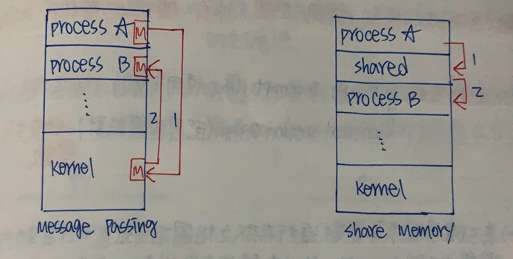
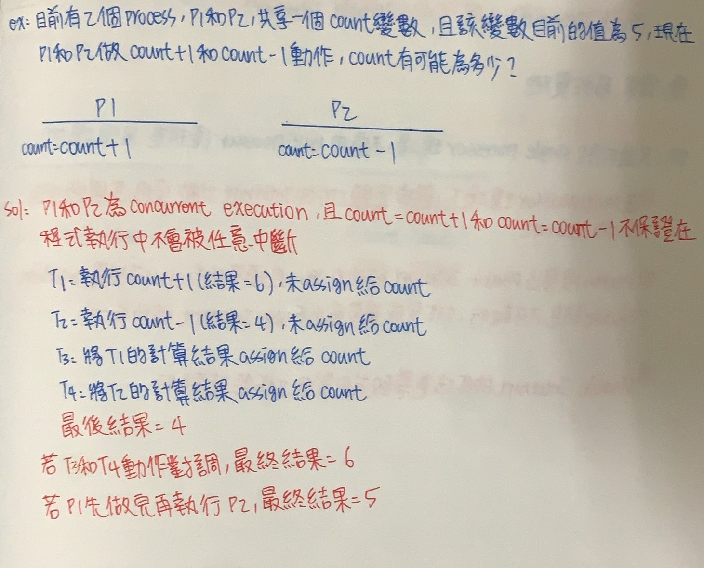
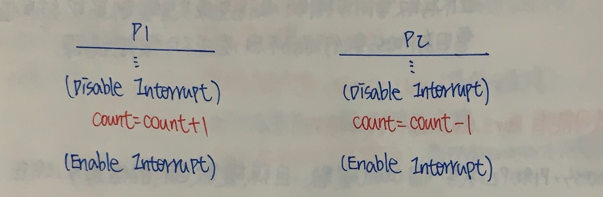
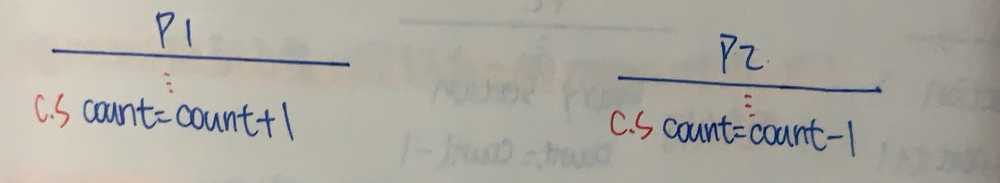
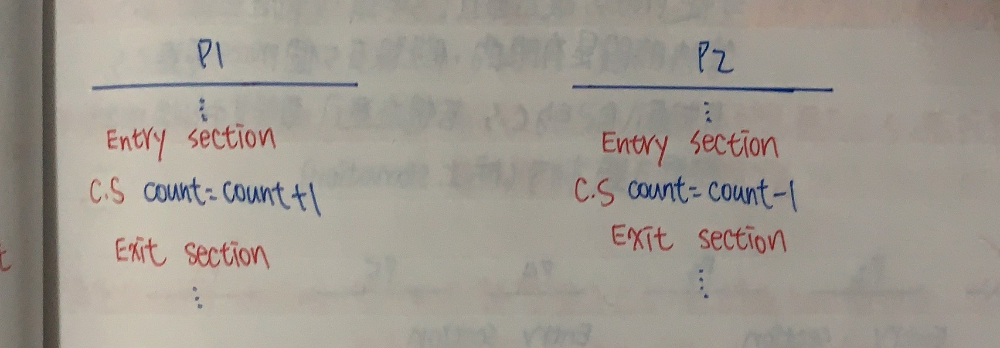
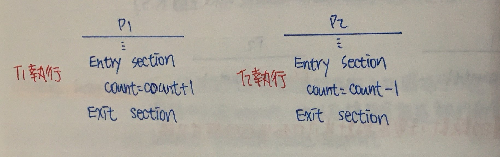
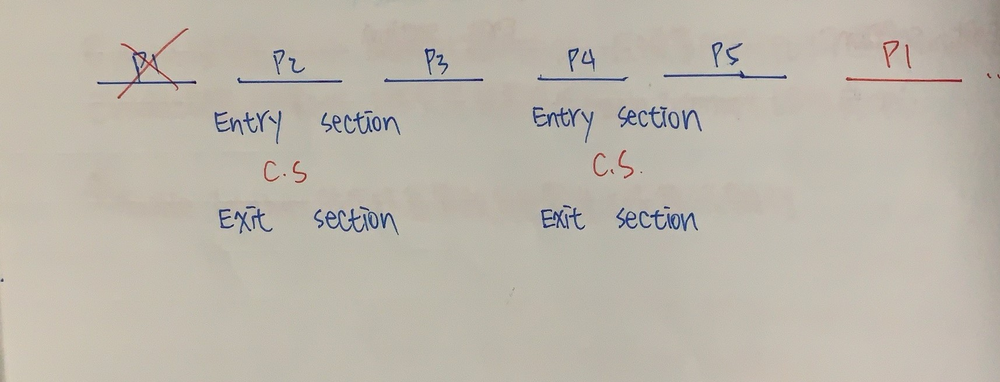

CH7 行程間溝通(Process Management)
======
### 為何Process之間需要溝通
+ 在現行的作業系統中，通常不會只有一種Process存在OS內，一般會有很多個Process同時存在System中並行進行(Concurrent Execution)

+ 存在System中並行執行的Process分成2類

    + 獨立行程(Independent Process) :如果一個Process無法影響其他Process執行，同時它不受其他Process影響，該Process為獨立行程，這類Process不會有任何共享資料

    + 合作行程(Cooperating Process) :如果一個Process能影響其他Process，或受到其他Process影響，它就屬合作行程，這些Process會共同完成一份工作，這類Process會共享資料，彼此需要資料交換和協調管道

+ 獨立的行程因為行程間不會互相影響，且行程間也是個自行完成各自工作，合作行程比較有討論空間

### Process Communication的方式

+ Share Memory方法 :

    + 各Process利用對共享Memory(共享變數)的存取來達到彼此溝通交換資訊

    + 提供對共享Memory之互斥存取控制的責任是由Programmer負責，OS只負責共享Memory空間，不提供額外Resource

+ Message Passing方法 :2個Process要溝通要遵守以下步驟

    + 建立Communication Link(溝通鏈接)

    + 互傳訊息

    + 傳輸完畢，Release Link(發佈鏈接)
    **此方法需要OS提供額外支援，(Link Management、Message Lost、Link Capacity容量控管)，而Programmer不須額外負擔**
    ```markdown
    |         Share Memory                     Message Passing
    | :----------------------------     :----------------------------                 
    |  Process彼此透過共享變數的存取       Process之間溝通須
    |  ，藉由其值改變達到溝通目的          1.建立Link
    |                                    2.建立後互傳Message
    |                                    3.Free Link
    | :----------------------------     :---------------------------- 
    |  共享變數所有Process都可存取        Link是屬於溝通雙方，不會被其他人使用                                 
    | :----------------------------     :---------------------------- 
    |  OS只提供Share Memory空間，不提供   OS會提供如Link Message等功能
    |  額外資源
    | :----------------------------     :---------------------------- 
    |  Programmer負擔重，OS輕             Programmer負擔輕，OS負擔重
    | :----------------------------     :---------------------------- 
    |  須提供對共享變數之互斥控制，否則    須提供Link Capacity、Link Creation
    |  會有問題                           Message Lost等處理
    ```

 

 ### 共享記憶體(Share Memory)

 ```
 一組Process在Share Memory中，若未對共享變數提供互斥存取等同步機制，則會造成共享變數最終結果值會因Process
 執行順序不同，造成不可預期錯誤
 ```
+ Share Memory方式可能有Race Condition(競爭狀況)



+ 需要對共享變數之存取進行管控，即同一時間只有一個Process可以使用

+ 解決Race condition的策略
    
    + Disable Interrupt(停止使用中斷) **鎖定CPU**

    + Circular Section Design(臨界區間設計) **鎖定共享變數**

### Disable Interrupt

```
為了確保對共享變數進行存取時之相關指令描述可以在執行過程中不會被Interrupt，所以在該指令敘述執行前先
Disable Interrupt，完成後再Enable Interrupt
```



**優點 :簡單、易實施**

**缺點 :只適用於Single Processor環境，不適用於Multiprocessor(表現差、風險增加)**

+ 在Multiprocessor環境下，關掉單顆CPU的Interrupt功能沒用，要關掉所有CPU的Interrupt

+ Process需發出Disable Interrupt給所有CPU，且須等待所有CPU均回覆Interrupt已Disable訊息才可執行，工作完成後需發送Enable Interrupt給所有CPU

+ Disable Interrupt的做法會導致其他緊急工作無法執行

### Critical Section Design(臨界區間設計)

```
提供對共享變數之存取動作的互斥控制，確保資料正確性
```

+ 在程式中，針對共享變數進行存取指令敘述所集合，非C.S之指令敘述集合稱Remainder Secction(剩餘空間R.S)



+ 臨界區間設計，主要設計其入口和出口的程式片段

+ 程式架構

    ```
    Repeat:
        Entry Section //進入臨界區間 :管制Process可否進入C.S的程式片段
        C.S
        Exit Section //離開臨界區間 :離開C.S後解除入口管制程式片段
        R.S
    Until False

    ```


### Critical Section Design須滿足3個特性

+ Mutual Exclusion(互斥) :在一個時間點最多只能有一個Process進入自己的C.S內活動，不允許多個Process同時進入



+ Progress(行進) :
    
    + 不想進入C.S的Process不可以阻礙其他Process進入C.S(即不可參與進入C.S的決策過程)

    + 必須在有限時間內，從那些想進入C.S的Process中挑選一個進入(防止Dead Lock)

+ Bounded Waiting(有限等待) :從Process提出進入C.S申請，到獲准C.S等待時間有限的，假設有5個Process要進入C.S，P1先進入自己的C.S，若想再進入，要等到其他4個Process都進去過才行(防止Starvation)



### Critical Section Design設定方法

+ Algorithm Base(自行設計演算法)

    + 2個Process設計方案 :3種Algorithm

    + N個Process設計方案 :1種Algorithm

### 2個Process設計方案(假設有兩個Process叫 Pi Pj)

+ **Algorithm 1** :共享變數宣告如下(Turn整數變數，初始可放 i和j )，設定Turn = i

```
    設計Pi程式設計                                  設計Pj的程式設計
    Repeat:                                         Repeat:
        while(Turn != i)do no-op //Entry                while(Turn != j)do no-op //Entry 
            C.S                                               C.S
        Tuen = j //Exit                                  Tuen = j //Exit
    Until False                                     Until False
```

``` 
1. 滿足Mutual Exclusion :Turn值不會同時擁有i或j，所以Pi和Pj不會同時進入自己的C.S

2. 不滿足Progress(不滿足條件1) :假設Turn在i，但Pi不想進入C.S，若Pj想進自己C.S無法進入，Pj被Pi阻擋

3. 滿足Bounded Waiting :若Pi和Pj都想進入C.S，此時Turn值決定，若Pi執行完想在重新進入C.S，此時Turn值=j，要等Pj執行完

```
**此演算法會阻礙不想進入自己C.S的Process**


+ **Algorithm 2** :

    + 共享變數宣告宣告如下 (Flag[n]=Boolean陣列，其中N等於i或j，當布林值等於True，表示Process有意願進入C.S，False等於不願意，Flag[i]和Flag[j]初值都是False)

```
 設計Pi程式設計                                  設計Pj的程式設計
    Repeat:                                         Repeat:
        Flag[i]=True                                    Flag[j]=True
        while(Flag[j])do no-op //Entry                  while(Flag[i])do no-op //Entry 
            C.S                                                 C.S
        Flag[i]=False    //Exit                         Flag[j]=False   //Exit
    Until False                                     Until False
```

```
1. 滿足Mutual Exclusion :當執行Pi時發現Flag[j]=True，會先執行Pj在執行Pi

2. 不滿足Progress(有Dead Lock產生) :  T1 : Flag[i]=True
                                     T2 : Flag[j]=True
                                     T3 : Pi卡在Flag[j] = True
                                     T4 : Pj卡在Flag[i] = True

3. 滿足Bounded Waiting :當雙方都有意願要進入自己C.S，Pi完成自己臨界區後，當它想在重新進入，會被卡住會先讓Pj執行
```
**此演算法一次只能一個Process是True，同時想進入會產生死結**

+ **Algorithm 3** :

    + 共享變數宣告如下 :Flag[n]=Boolean陣列，其中N值為i或j，Flag[i]或Flag[j]初始值等於False，
    Turn為整數變數，存放i或j都可

```
 設計Pi程式設計                                        設計Pj的程式設計
    Repeat:                                                Repeat:
        Flag[i] = True                                         Flag[j] = True
        Turn = j                                               Turn = i
        while(Flag[j] && Turn == j)do no-op //Entry            while(Flag[i] && Turn == i)do no-op //Entry 
                C.S                                                    C.S
        Flag[i]=False    //Exit                                Flag[j]=False   //Exit
    Until False                                            Until False
```

```
1. 滿足Mutual Exclusion :Pi或Pj想進入C.S，Flag[j]、Flag[i] = True，且分別執行到Turn = i和Turn = j設定(只是
    先後順序不同而已)，因此Turn只會是i或j而已，絕不會兩皆是 

2. 滿足Progress :若Pi不想進入自己C.S，則Flag[i] = False，只有想進入C.S會發出Flag =True，若兩個Process
    都想進入自己的C.S，可以在有限時間內挑出一個來執行
                            
3. 滿足Bounded Waiting :當雙方都有意願要進入自己C.S，Pi完成自己臨界區後，當它想在重新進入，會被卡住會先讓Pj執行
```

**此演算法3個性質都可以滿足**

### N個Process設計方案

+ **Bankery Algorithm(麵包店演算法)** :麵包店發號碼牌，有意願進入C.S抽一張號碼牌，號碼可能會相同，如果相同，憑Process ID大小，小的優先

    + 共享變數宣告如下 :
    ```
    Choosing[0...n-1]of Boolean，初值等於False
    
    True 代表有意願進入C.S並且正在挑號碼牌

    False 代表無意願(初值是False)或者是有意願進入並且號碼牌已經拿完

    Number[0...n-1]of Integer，初值等於0

    Number[i] = 0表示Pi無意願進入C.S

    Number[i] > 0表示Pi有意願進入C.S

    ```
    
```
設計Pi程式設計                                          設計Pj的程式設計
   Repeat:                                                 Repeat:
       Choosing[i] = True   //正在挑號碼牌                      Choosing[j] = True
       Number[i] = Max[Number[0]...Number[n]] + 1//找最大值     Number[j] = Max[Number[0]...Number[n]] + 1 
       Choosing[i] = False   //挑完號碼牌                       Choosing[j] = False
        for j=0 to n-1       //Entry                           for i=0 to n-1 
        {                                                      {
            while(Choosing[j])do no-op//等待其他人抽號碼牌         while(Choosing[i])do no-op
             while(Number[j] != 0 &&                              while(Number[i] != 0 &&         
             (Number[j],j) < (Number[i],i))do no-op               (Number[j],j) < (Number[i],i))do no-op
             //當Pi號碼牌大於Pj卡住
        }                                                      }
                C.S                                                     C.S
            
        Number[i]=0    //Exit 表示無意願                       Number[j]=False   
    Until False                                            Until False
```  

+ **問題一** :為甚麼會有 >=2 Process取得相同號碼牌
    
    + 指令Number[i] = Max(...) + 1 可以分成3個動作
        
        + 挑最大值

        + 加1

        + 將數值Assign回Number[i]

    + 假設目前Pi和Pj 2個Process，且目前最大的Number值為K，以下執行

    ``` 
                    Pi                              Pj
        ---------------------------------------------------------------------
        T0         Choosing[i] = True

        T1                                     Choosing[j] = True

        T2      執行Max(..) + 1，得K+1    
                但未Assign回Number[i]

        T3                                    執行Max(...) + 1，得K+1
                                              且Assign回Number[j]，Number[j]=K+1

        T4      執行K+1，Assign回給Number[i]
                故Number[i] = K+1
    ```

    **Pj和Pi有相同Number值**

+ 問題2 :移除for迴圈第一個While迴圈敘述，結果是否正確

    + 不正確，會違反互斥

    + 假設目前Choosing[0] ~ Choosing[n-1]值皆為False，且所有號碼牌值Number[0] ~ Number[n-1]皆為0，現有2個Process，Pi和Pj要進入C.S且Process ID為i < j，以下執行

    ```
                        Pi                              Pj
        -----------------------------------------------------------------------------
        T0         Choosing[i] = True

        T1                                     Choosing[j] = True

        T2      執行Max(..) + 1，得K+1    
                但未Assign回Number[i]

        T3                                    執行Max(...) + 1，得K+1
                                              且Assign回Number[j]，Number[j]=K+1

        T4                                    Choosing[j] = False

        T5                                    順利執行完For Loop不會被Pi和任何Process
                                              卡住，假設執行到一半Interrupt，其他Process
                                              也能執行
        T6      執行完Number[i] =K + 1
                Assign動作

        T7      設定Choosing[i] = False

        T8      順利執行完For Loop不會被其他
                Process卡住，也就是認為所有
                Process無意願
    ```

+ 問題三 :證明以下3個特質都符合

    + 滿足Mutual Exclusion :

        + 若所有Process的號碼牌都不同，則最小號碼牌Process是唯一可以進入C.S

        + 若最小號碼牌值Process有2個以上，但因Process ID都不同，所以會是從最小ID Process進入C.S

            **上述Case中，其他未進入Process都會被卡在While(Number[i] != 0 && (Number[j],j) < (Number[i],i) do no-op)，確保只有一組Process進入**

    + 滿足Progress :

        + 若Pj不想進入C.S，Number[j]=0和Choosing[j] = false，若Pi想進入自己C.S不會被卡住，Pj不會阻礙Pi

        + 若多組Process想進入C.S，可以在有限時間內找到一組號碼最小、或ID最小Process進入C.S

    + 滿足Bounded Waiting :

        + 若P0~Pn-1想進入自己C.S，假設號碼牌不同，此時P0先進入若執行完後想馬上進入C.S，需要重新抽號碼牌但重抽號碼牌一定大於n，所以P0不會馬上進入，會等一輪大家都進去自己C.S後再進入

        + 若P0~Pn-1想進入自己C.S，假設他們號碼牌相同，此時比較Process ID，若P0先進入，執行完後又想馬上進入自己C.S
        但新號碼牌一定大於n，所以P0不會馬上進入，會等一輪大家都進去自己C.S後再進入

### HW指令支援To C.S Design

```
System直接提供一組Atomic(原生)特性指令，讓程式碼可以一氣呵成，不會被Interrupt
```

+ **Text And Set指令**

    + 此指令為Atomically Executed，即在單位內可以順利執行完，不會被Interrupt

    + 功能定義如下:
    ```
    int Text_And_Set(int *Target)               程式解釋:
    {                                               將傳入的Target舊值回傳出去當成該函式回傳值並經Target
        int Temp=*Target;                             設為True
        *Target=1;
        return Temp;
    }
    ```

    + 如何使用在C.S Design上(共享變數宣告如下 :Lock = Boolean，初值 = False)

    ```
    設計Pi程式設計                                        設計Pj的程式設計
    Repeat:                                                Repeat:
        while(Text_And_Set(Lock))do no-op //Entry            while(Text_And_Set(Lock))do no-op //Entry 
                C.S                                                    C.S
        Lock=False   //Exit                                  Lock=False //Exit
    Until False                                            Until False
    ```

+ 假設Pi和Pj想進入自己C.S

```
                Pi                                       Pj
--------------------------------------------------------------------------
T0      Pi搶到Text_And_Set(Lock)
        此時回傳False且Lock設為True
        此時Pi進入自己C.S

T1                                           當Pi未完成執行Pj時，檢查Text_And_Lock
                                             為True，Pj被卡在迴圈內                                      
```

```
1. 滿足Mutual Exclusion :當Process取得控制權後，其他Process只能旁邊等

2. 滿足Progress :不想進入C.S的Process不會執行Text_And_Set(Lock)，且在有限時間內一定有人可以進入C.S

3. 不滿足Bounded Waiting :Pi進入C.S後，想重新進入是可以重複進入的，會有Starvation(用Aging技術解決)

```
                            
+ **Swap指令**

    + 此指令為Atomically Executed，即在單位內可以順利執行完，不會被Interrupt

    + 功能定義如下 :
    ```
    void Swap(int *a,int *b)
    {
        int Temp = *a;
        *a = *b;
        *b = Temp;
    }
    ```

    + 如何使用在C.S上(共享變數宣告如下 :Lock = Boolean，初值 = False)

    ```
    設計Pi程式設計                                        設計Pj的程式設計
    Repeat:                                                Repeat:
        Key = True //Entry                                      Key = True
        Repeat     //Entry                                      Repeat
            Swap(Lock,Key)  //Entry                                 Swap(Lock,Key) 
        Until Key == False   //Entry                             Until Key == False
            C.S                                                      C.S
        Lock = False         //Exit                             Lock = False
    Until False                                            Until False
    ```

    + 假設Pi和Pj都想進入自己C.S
    ```
                     Pi                                   pj
        -----------------------------------------------------------------
        T0      Pi搶到Swap(Lock,Swap)指令
                執行。此時Lock和Swap值互換
                Lock = True、Key = False
                Pi進入C.S
        T1                                       當Pi未執行完執行Pj，Swap後
                                                 Lock和Key值皆為True，被卡在迴圈
    ```

    ```
        1. 滿足Mutual Exclusion :當有Process取得控制權，Lock = True執行Swap不會通過

        2. 滿足Progress :不用C.S的Process不會去搶Swap使令，且在有限時間內一定有人搶到Swap進入C.S

        3. 不滿足Bounded Waiting :Pi進入C.S後，想重新進入是可以重複進入的，會有Starvation(用Aging技術解決)
    ```

### Semaphare