CH8 記憶體管理
======

### Blinding即其時期 :Blinding意思決定程式起始位置

+ 程式在Memory哪個地方開始執行，所有程式和Data均在Memory中方可為CPU做使用，連帶程式內宣告Data和變數位於Memory甚麼地方也確認了

+ Blinding時期有三個

    + Compiling Time(編譯時期)
    
    + Loading Time(載入時期)

    + Execution Time(執行時期)

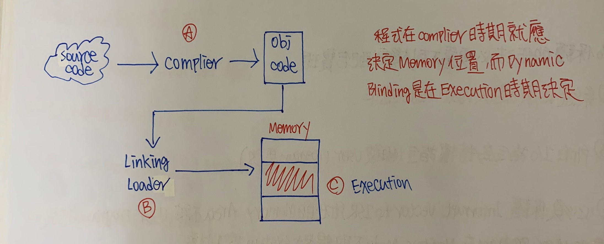

+ Compiling Time(編譯時期) :由Compiler決定

    + 將來程式執行的起始位置是固定的，不得Change，所編譯出來的目的碼為Absolute OBJ Code，若所決定位置有其他程式執行，則必須重新Compiler，彈性小

    + 不支援Relocation(重定位)

    + 若要變更程式執行起始位置，需重新編譯

+ Loading Time :由Linking Loader決定

    + Linking Loader通常做4件事 

        + Linking

        + Allocation

        + Loading

        + Relocation
    
    + 程式不一定都從固定位置開始執行，所以每次程式重執行，只需重新Linking Loader一次即可

    + 支援Relocation

    + 缺失 :在Execution Time沒有呼叫到模組仍事先Linking、Allocation、Loading，浪費Memory也浪費時間，若副程式很多，每次執行皆需再做4項工作，很耗時，且程式執行期間仍不可Change起始位置

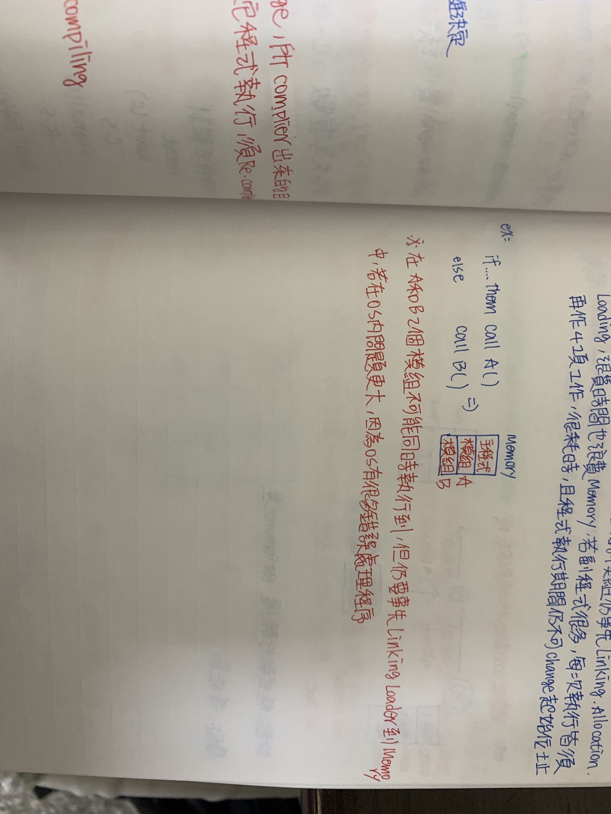

+ Execution Time :由OS決定，又稱Dynamic Blinding

    + 在程式執行期間才決定程式起始位置，表示程式執行期間可以任意變更起始位置

    + 所需要硬體資源

        + OS會用一個Base Register紀錄目前程式起始位置

        + 每次CPU送出的Local Address皆須和Base Register相加，才能得到Physical Address，再到Memory存取

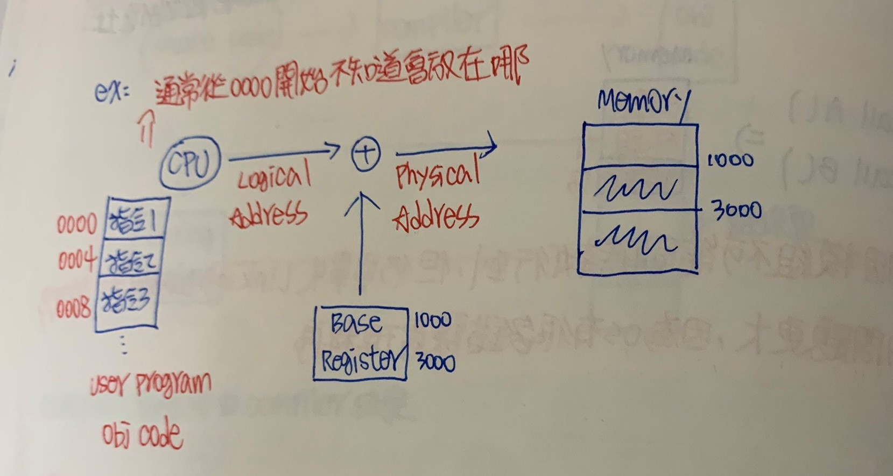

**優點 :彈性高**

**缺點 :程式執行慢，Performance差**

### Dynamic Loading(動態載入)

+ 在程式執行中當某個模組真正被呼叫到時才被載入到Memory中

+ 主要目的是要節省Memory空間，發揮Memory utilization

### 動態變動分區之Memory Management

+ 在Multiprogramming下，Memory存在多個Process執行，且每個Process的Size不同，進入System和完成工作時間也不同

+ OS採用Contiguous Allocation方法(連續分配)，根據各Process大小，找到一塊連續可用記憶體空間配置給Process使用

+ OS會利用Link List保存Free Block，稱AV-List(Available list)

### 動態分配Allocation方法

+ First Fit :若需要Memory大小=N，從AV List頭部開始搜尋，直到找第一個Free Block大於等於N

    + 缺點 :在經過多次分配後，易在AV-List前端附近產生非常小可用空間(配置機會小)，而每次搜尋都會經過這些區塊，增加搜
    尋時間

+ Next Fit :從上次分配後的下一個Block開始搜尋，直到找到第一個Free Block Size大於等於N，通常AV-List會以
Circular-link-list表示

+ Best Fit :若所需Memory大小為N，從AV-List所有Block中找出Size大於等於N且(Size-N)值最小者

+ Worst Fit :若所需Memory為N，從AV-List中所有Block找出Size大於等於N且(Size-N)最大值

```
                    Time效益            空間利用率
    -----------------------------------------------------------------
    First Fit           優                可能優

    Best Fit            差                 優

    Worst Fit           差                 差

    Next Fit            優                 優

```

+ 不論First/Best/Next/Worst Fit Allocation都有共同問題存在

    + 都有外部碎裂問題(External Fragmentation)

    + 配置完成後所剩極小Free Block仍會保留在AV-List中，徒增Search Time成本

+ 解決辦法 :OS規定一個N值，當(Free Block Size-Process大小) < N，則整個Free Block分配給此Process

### 外部碎裂(External Fragmentation)

+ 在連續分配下，可能Memory中所有Free Block的Size >= Process需求大小，但因為這些Block的Memory不連續，形成Memory浪費

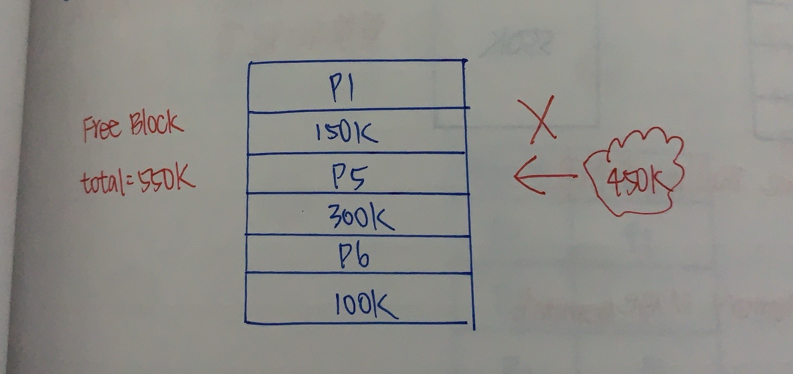

### 內部碎裂(Internal Fragmentation)

+ OS分配給Process的Memory空間大於Process本身實際所需空間，此差值自身和其他Process用不到，形成空間浪費


### 解決外部碎裂問題

+ 壓縮(Compation) :移動執行中Process，使不連續的Free Block可以聚集成一塊夠大連續Memory

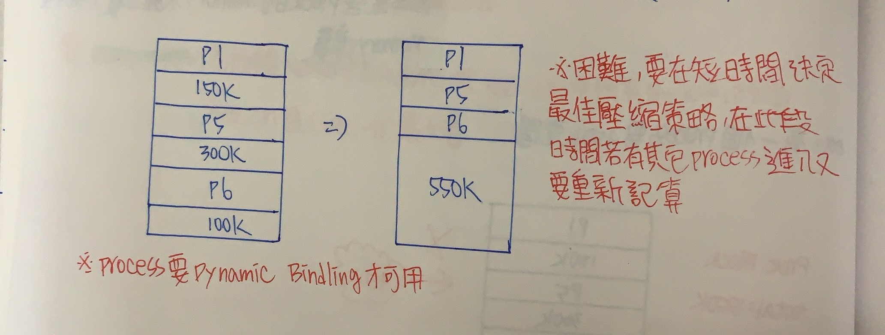

+ 利用Page Memory Management

### Page Memory Management(分頁記憶體管理)

+ 實體Memory(Physical Memory) :視為一組頁框(Frame)之集合，各Frame大小都相等

+ 邏輯Memory(Logical Memory) :即User Program，視為一組頁面(Page)集合，頁面大小等同頁框大小

+ 配置方法 : 

    + 假設User Program大小為N個Page，則OS只要在實體記憶體上找到 >= N個Free Frame即可配置

    + 採取Non-Contiguous Allocation(不連續分配)，即分配給User Program的多個Frame不一定要連續

    + 不用連續配置空間，可以消除外部碎裂問題

+ OS會為每個Process建立一個Page Table表格紀錄每個Page被載入Frame編號和起始位置

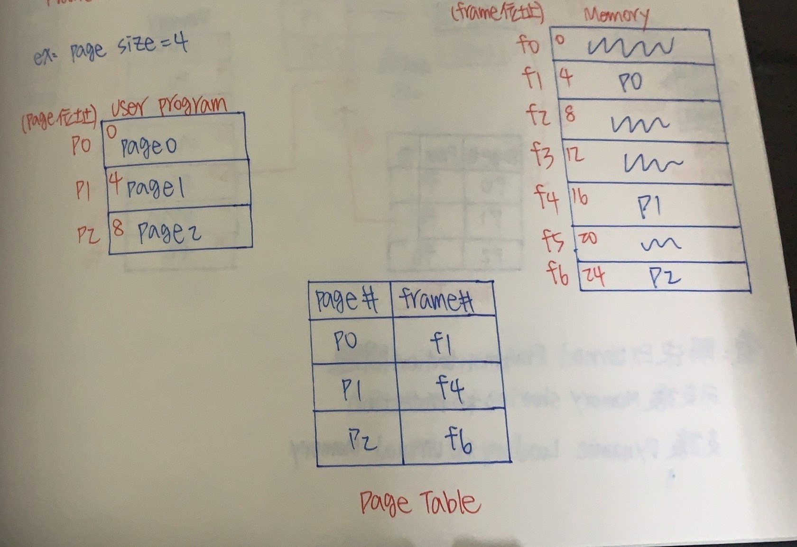

+ Logical Adress轉成Physical Address過程

    + CPU送出一個單一Logical Address

    + 此Logical Address會自動拆解成下面兩個值分別為p和d

    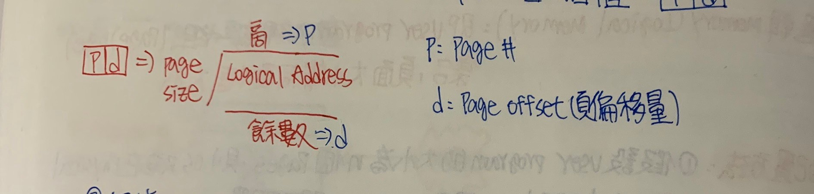

    + 根據p去查Page Table，取得該Page之對應頁框f的起始位置或編號(起始位置 = 頁框大小 + 頁框編號)

    + f起始位置 + d = Physical Address

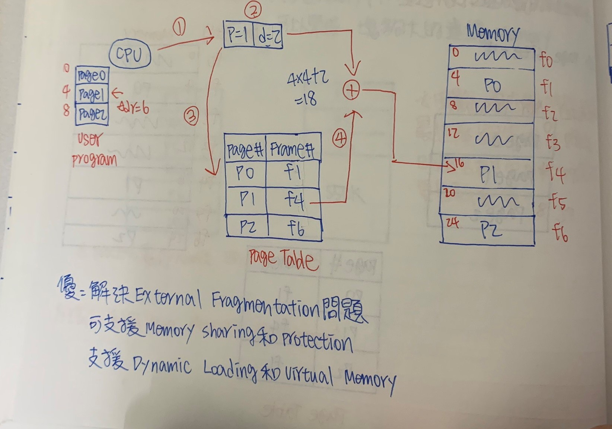

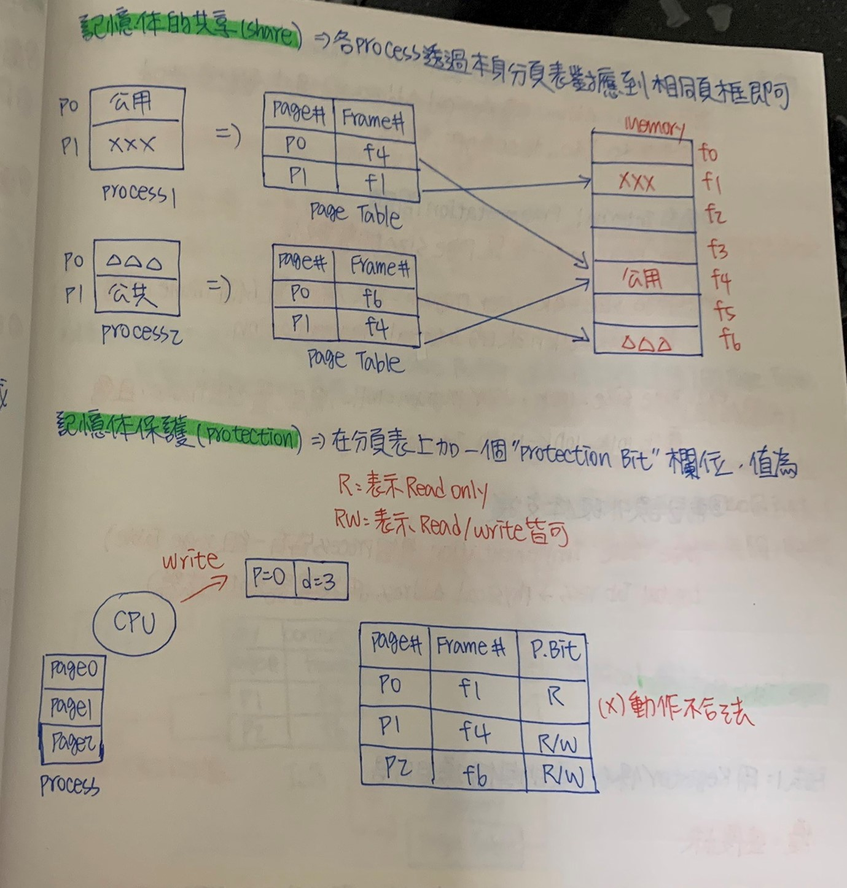

### 記憶體保護缺點

+ Memory有效存取時間較長

    + 因為Logical Address轉Physical Address過程中，要計算p和d且有查表和f跟d相加動作，耗時

    + 會有內部碎裂問題，因為User Program不一定是Page Size的整數倍

        + EX1 : Page Size = 4k，User Program = 21k，需要配置6個Frame，且會產生24k - 21k = 3k的內部碎裂

        + EX2 : Page Size = 100k，User Program = 101k，需配置2個Frame且會產生200k - 101k = 99k的內部碎裂

    + 需要額外硬體支援

        + Page Table Implementation(每個pROCESS都有自己一組Page Table)，Logical Address -> Physical Address(用搜尋器和加法器)

### Page Table的製作

+ 方法1 :用Register保存分頁每個項目內容

    **優點 :速度快**

    **缺點 :僅適用Page Table Size較小狀態，太大的Page Table不適合**

+ 方法2 :Page Table存在Memory中，OS利用一個PTBR(Page Table Base Register)來記錄此Page Table在Memory初值位置

    **優點 :適用Page Table Size較大狀況**

    **缺點 :速度慢，因為需要兩次Memory Access(一次用於Memory取出Page Table，一次用於真正Data Access，浪費許多時間)**

+ 方法3 :使用TLB(Transaction Lookaside Buffer)來保存部分(常用)的Page Table，完整的Page Table存在Memory中(若沒有Hit
中花費時間會比方法1和方法2時間多)

    + 查詢Page Table過程

        + 首先，到TLB查詢有無對應Page Number存在

        + 若Hit，輸出Frame的起始位置，如方法1

        + 若Miss，到Memory取出Page Table查詢取得Frame起始位置

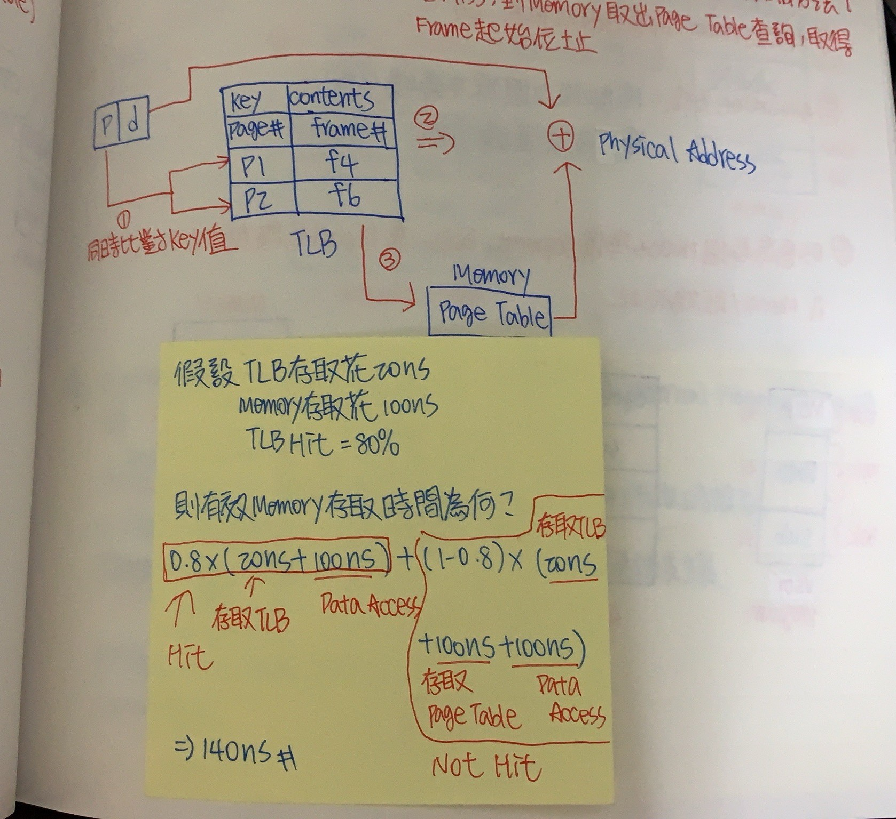

### Segment Memory Management(分段記憶體管理)

+ 實際Memory(Physical Memory) :不用事先區分Memory空間，若Memory中存在Process所需夠大Free Memory Space，即將空間配置出去

+ 邏輯Memory(Logical Memory) :即User Program，視為一組段(Segment)集合，各段大小不同

+ 何謂Segment?

    + Main、Subroutine、Datasection等

+ 分段對Memory看法和User一致

+ 分配方法

    + 段和段之間採不連續分配

    + 單一段採連續分配

+ OS會為每個Process準備Segment Table，來記錄各段大小和各段仔入Memory起始位置

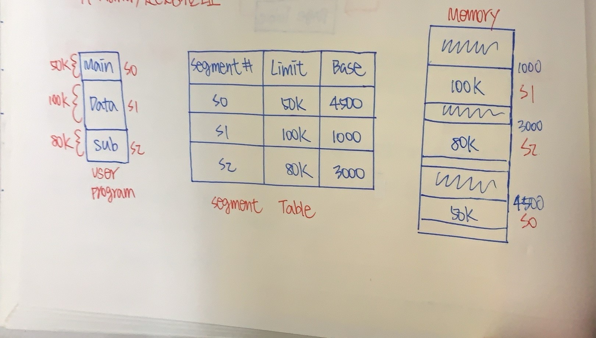

+ Logical Address轉乘Physical Address

    + CPU送出兩個值的Logical Address，分別為s(Segment)和d(Segment Offset(段偏移))

    + 根據S去查Segment Table，取得該段Limit

    + 檢查d < Limit成立，表示合法存取，取出該段Base，執行下一步，否則Illegal Memory Access，Stop

    + d + Base得出Physical Address

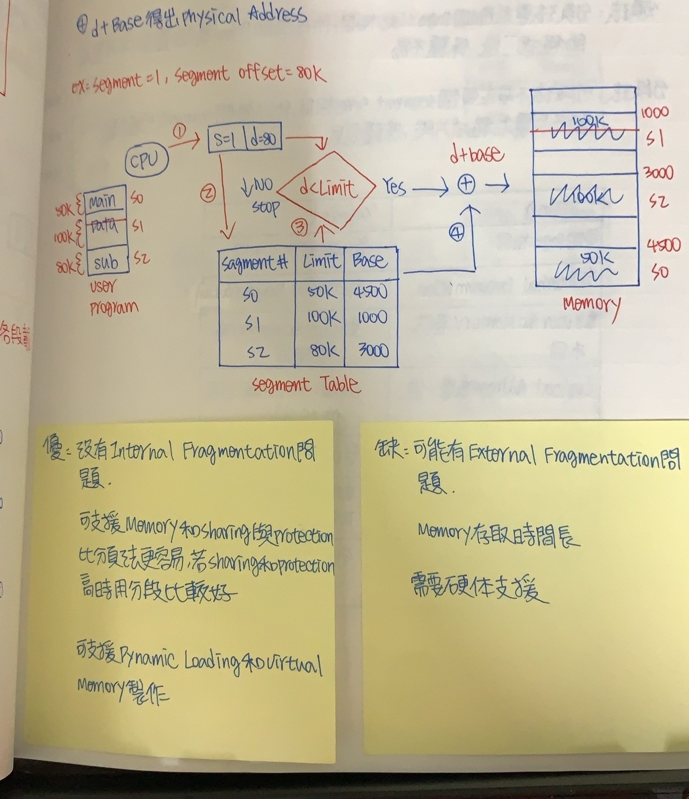

### 為何分段法比分頁法更容易達到共享和保護

+ 假設主程式Main和副程式Sub設為Read Only，Data為R/W

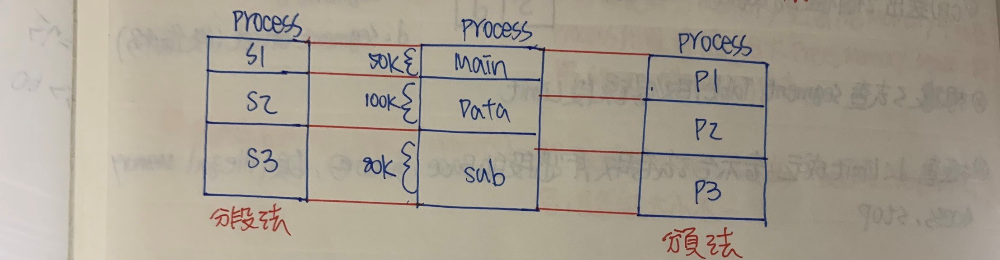

+ 分頁法 :分頁法要求每個Page Size相同，所以有的Page會涵蓋到不同需求程式片段，保護不易

+ 分段法 :分段法部要求每個Segment Size相同，所以每個Segment可涵蓋到不同需求程式片段，保護容易

```
            Pageing                             Segment
----------------------------------------------------------------------
        每個Page相同                        各Segment大小不同
----------------------------------------------------------------------
        有內部碎裂問題                      有外部碎裂問題
----------------------------------------------------------------------
        對User和Memory看法不同              對User和Memory看法一致
----------------------------------------------------------------------
        邏輯位置為單一值                    邏輯位置為2個值(s和d)
----------------------------------------------------------------------
        不用檢查 d< Page Size               要檢查 d < Limit
----------------------------------------------------------------------
        對Memory Sharing和Protection        對Memory Sharing和Protection    
        難                                  簡單 
----------------------------------------------------------------------
        分頁表不用Page Size                 分段表要Segment Limit

```

### Page Segment Memory Management(分頁式分段)

+ 觀念 :

    + 段再分頁

    + User Program由一組Segment所組成，每個段由一組Page組成

    + 每個Process都有一個Segment Table，每個段都有一個Page Table

+ 目的 :

    + 保有分段法的User和Memory看法一致Sharing/Protection實作容易

    + 避免分段法外部碎裂問題

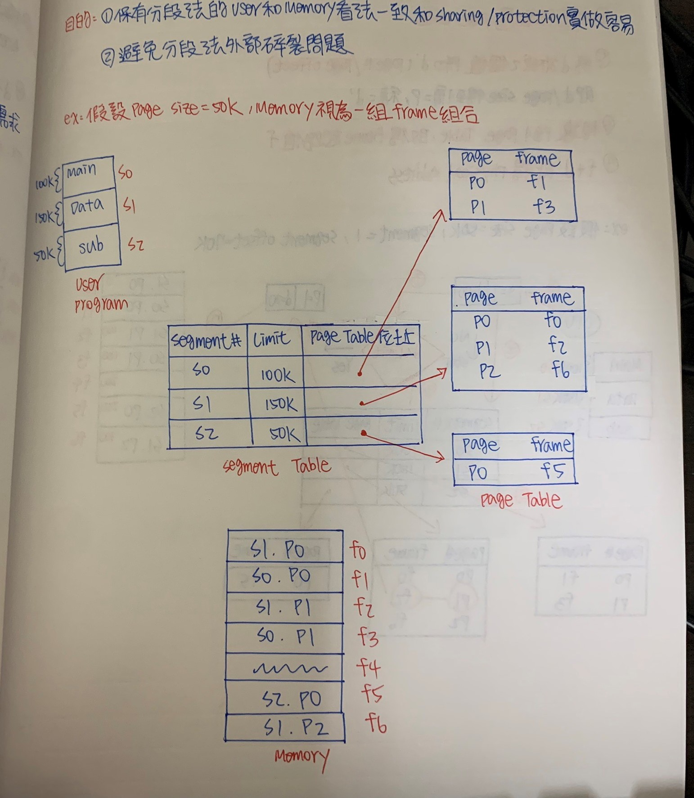

+ Logical Address轉Physical Address

    + CPU送出兩個值的Logical Address(同Segment)s和d

    + 根據s去查Segment Table，取得該段Limit

    + 檢查d < Limit，成立下一步，不成立Stop

    + 取出相對應Page Table

    + 將d拆成兩個值p和d(Page/Page Offect)，即d/Page Size得(商 = p，餘 = d)

    + 根據p到Page Table，取得Frame起始值f

    + f + d即得Physical Address

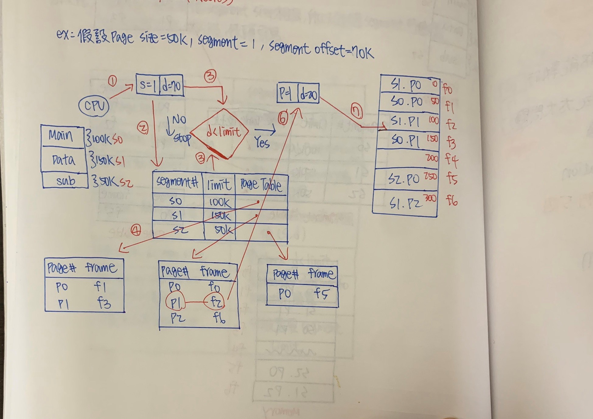

+ 分析 :

    + 沒有外部碎裂問題
    
    + 有內部碎裂問題(因為最終是分頁)

    + Table數目多，占空間

    + Memory Access Time長

